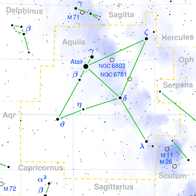

## [天鹰座 Aquila](http://www.seasky.org/constellations/constellation-aquila.html)
### Date range: January 14 - 28

The constellation Aquila, the eagle, is visible in the northern hemisphere from July through October. It can be seen between latitudes 90 degrees and -75 degrees. It is a mid-sized constellation, spanning 652 square degrees of the sky. This makes it the 22nd largest constellation in the night sky. It is bordered by the constellations Aquarius, Capricornus, Delphinus, Hercules, Ophiuchus, Sagitta, Sagittarius, Scutum, and Serpens Cauda. Aquila’s brightest star Altair forms part of the famous Summer Triangle, along with Deneb in Cygnus and Vega in Lyra.

The name Aquila means “Eagle” in Latin. It represents the eagle that carried Zeus’ thunderbolts and also brought the mortal Ganymede to the heavens to serve as Zeus' cupbearer. In another myth, Aquila represents the goddess Aphrodite. She disguised herself as an eagle and pretended to pursue Zeus in the form of a swan. She did this so that Zeus’ love interest, the goddess Nemesis, would give him shelter. Zeus later placed the eagle and the swan in the heavens as constellations. Aquila has been known since the time of the ancient Babylonians, who also saw it as an eagle. To the ancient Romans, the constellation represented a flying vulture.

|Object|Designation|Name/Meaning|Ojbect Type|V Mag|
---:|:---:|:---:|:---:|:---:
1|Altair|"The Flying Eagle"|Blue Subdwarf Star|0.77
