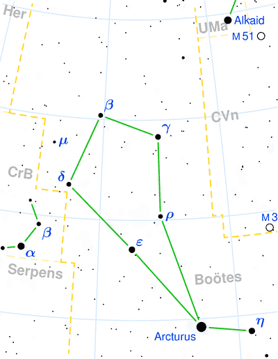

## [牧夫座 Bootes](http://www.seasky.org/constellations/constellation-bootes.html)

The constellation Boötes, the herdsman, is visible in the northern hemisphere from spring through the summer. It can be seen at latitudes between 90 degrees and -50 degrees. It is a large constellation covering an area of 907 square degrees. This makes it the 13th largest constellation in the night sky. It is bordered by Virgo to the south, Coma Berenices and Canes Venatici to the west, Ursa Major to the northwest, Draco to the northeast, and Hercules, Corona Borealis and Serpens Caput to the east.

Boötes is one of the 48 constellations listed by the Greek astronomer Ptolemy in the second century. Its name comes from a Greek word that means "ox driver, plowman, or herdsman". It is typically depicted as a herdsman. Along with his faithful hounds, Canes Venatici, he follows the two bears, Ursa Major and Ursa Minor, around the pole. Boötes is an ancient constellation that has been known since the time of the Babylonians. They depicted it as their god Enlil, who was the leader of the Babylonian pantheon and the patron of farmers. The ancient Greeks once called this constellation Arctophylax, which means "the protector of the Bear". The Romans called it Venator Ursae, "the Bear Hunter". The name Boötes first appeared in The Odyssey, written by the Greek author Homer almost three thousand years ago.

|Object|Designation|Name/Meaning|Ojbect Type|V Mag|
---:|:---:|:---:|:---:|:---:
1|Arcturus|"Guardian of the Bear"|Orange Giant Star|-0.04
2|Izar|"Veil"|Binary Star System|2.37
