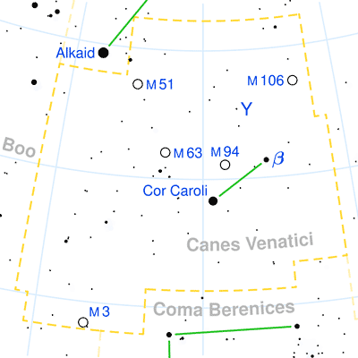
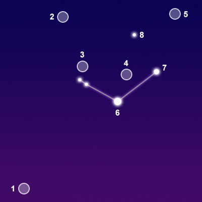

## [猎犬座 Canes Venatici (The Hunting Dogs)](http://www.seasky.org/constellations/constellation-canes-venatici.html)

The constellation Canes Venatici, the hunting dogs, is visible in the Northern Hemisphere in spring and summer. It is visible at latitudes between 90 degrees and -40 degrees. It is a medium-sized constellation covering 465 square degrees of the sky. It ranks 38th in size among the 88 constellations in the night sky. It is bordered by Ursa Major to the north and west, Coma Berenices to the south, and Boötes to the east.

Canes Venatici was originally included in the constellation Ursa Major by the Greek astronomer Ptolemy in the second century. The constellation’s name means “hunting dogs” in Latin. There are no myths associated with this constellation. It represents the hunting dogs, Asterion and Chara, held by Boötes as he hunts for the bears Ursa Major and Ursa Minor in the night sky. The two dogs were first depicted with Boötes on a map by the German astronomer Peter Apian in 1533. The stars were separated out by the Polish astronomer Johannes Hevelius in 1687. He took the faint stars under the bear’s tail and formed the modern constellation Canes Venatici.

|Object|Designation|Name/Meaning|Object Type|V Mag|
---:|:---:|:---:|:---:|:---:
1|M3|N/A|Globular Star Cluster|6.20
