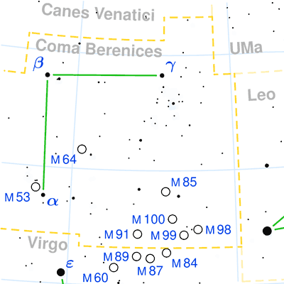
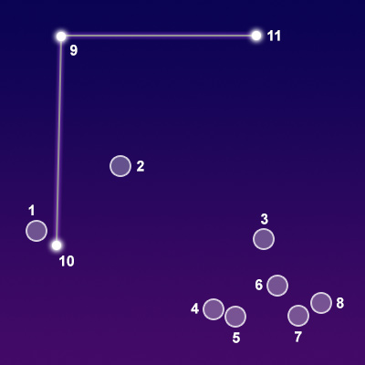

## [后发座 Coma Berenices](http://www.seasky.org/constellations/constellation-coma-berenices.html)
The constellation Coma Berenices, Berenice's hair, is visible in the northern hemisphere in spring and summer. It is visible at latitudes between 90 degrees and -70 degrees. It is a medium-sized constellation occupying 386 degrees of the sky. It ranks 42nd in size among the 88 constellations in the night sky. It is bordered by the constellations Boötes, Canes Venatici, Leo, Ursa Major, and Virgo.

Coma Berenices was original considered part of the constellation Leo by the second century Greek astronomer Ptolemy. It originally represented the tuft at the end of the Lion’s tail. It remained there until the 16th century when the cartographer Caspar Vopel separated the stars out into a new constellation. The Danish astronomer Tycho Brahe included Coma Berenices in his star catalog which was published in 1602. It was named after Queen Berenice II, the wife of Ptolemy III of Egypt, whose beautiful long hair was given to Aphrodite as a gift. Aphrodite was so pleased by this gift that she placed it in the night sky. To this day the constellation is known as Berenice’s Hair.

|Object|Designation|Name/Meaning|Ojbect Type|V Mag|
---:|:---:|:---:|:---:|:---:
1|M53|N/A|Globular Star Cluster|7.60