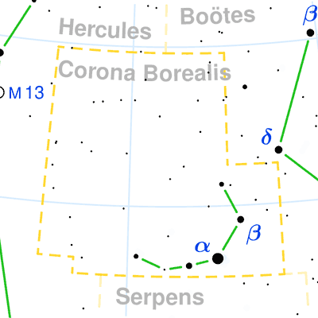
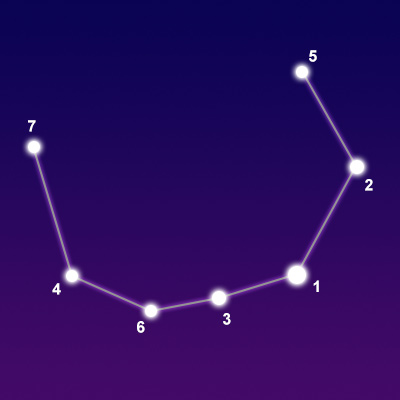

## [Corona Borealis](http://www.seasky.org/constellations/constellation-corona-borealis.html)

The constellation Corona Borealis, the northern crown, is visible in the northern hemisphere in the spring and summer. It can be seen at latitudes between 90 degrees and -50 degrees. It is a small constellation covering 179 square degrees of the sky. It ranks 73rd in size among the 88 constellations in the night sky. It is bordered by Boötes to the north and west, Serpens Caput to the south, and Hercules to the east.

Corona Borealis is one of the 48 constellations listed by the Greek astronomer Ptolemy in the second century. Its name means “northern crown” in Latin. This is an ancient constellation that has its roots in many cultures. It has been depicted as a circle of elders, an eagle’s nest, and a bear’s den. In Celtic mythology, it was known as Caer Arianrhod, the Castle of Arianrhod. It represented the home of the Lady Arianrhod. In Greek mythology, it represented the crown that Ariadne, the daughter of King Minos of Crete, wore at her wedding. Her ball of thread helped Theseus defeat the Minotaur and find his way out of the labyrinth. Theseus gave her the crown when they married. The crown was created by the supreme goldsmith of the gods, Hephaestus.

|Object|Designation|Name/Meaning|Ojbect Type|V Mag|
---:|:---:|:---:|:---:|:---:
1|Alphecca(Gemma)|"Broken Ring"|Binary Star System|2.23
2|Nusakan|"The Two Series"|Binary Star System|3.68
3|Gamma Coronae Borealis|N/A|Binary Star System|3.84
4|Epsilon Coronae Borealis|N/A|Multiple Star System|4.13
5|Theta Coronae Borealis|N/A|Binary Star System|4.13
6|Delta Coronae Borealis|N/A|Yellow Giant Star|4.63
7|Iota Coronae Borealis|N/A|Binary Star System|4.98