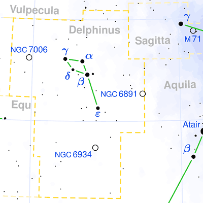

## [海豚座 Delphinus](http://www.seasky.org/constellations/constellation-delphinus.html)

The constellation Delphinus, the dolphin, is visible in late summer from the Northern Hemisphere. It can be seen at latitudes between 90 degrees and -70 degrees. It is a small constellation, occupying an area of only 189 square degrees. This ranks it 69th in size among the 88 constellations in the night sky. This constellation is bordered by Aquarius, Aquila, Equuleus, Pegasus, Sagitta, and Vulpecula. It bears a remarkable resemblance to a dolphin leaping out of the water. Because of this shape, it is easy to recognize in the sky.

Delphinus is one of the 48 constellations cataloged by the Greek astronomer Ptolemy in the second century. Its name means “the dolphin” in Latin. It is an old constellation with roots in many ancient cultures. The Chinese knew it as the Black Tortoise of the North. On the island of Pakapuka, it was called Te Toloa. The people of the Tuamotus islands called it Te Oru-o-tiki. In Greek mythology, it was believed to represent a dolphin that helped Poseidon locate the mermaid, Amphitrite, whom he wished to marry. As a reward, Poseidon placed the dolphin among the stars. In another version of the myth, the god Apollo placed the dolphin in the sky for saving the life of Arion, a musician from the island of Lesbos who was skilled with the Lyre. Apollo placed the dolphin next the constellation Lyra, which represented Arion’s Lyre.

|Object|Designation|Name/Meaning|Object Type|V Mag|
---:|:---:|:---:|:---:|:---:
1|Rotanev|"Venator" Spelled Backwards|Binary Star System|3.64
