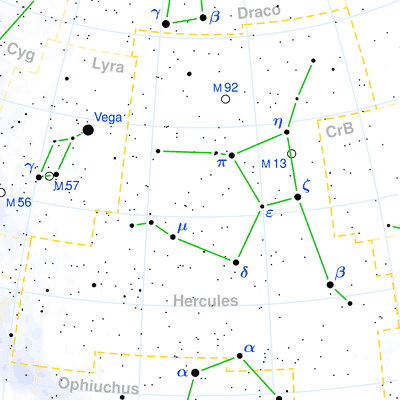
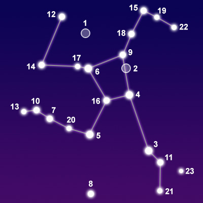

## [武仙座 Hercules](http://www.seasky.org/constellations/constellation-hercules.html)

The constellation Hercules, the strongman, is best seen during the summer in the northern hemisphere. It is visible in the southern hemisphere from May until August at latitudes between 90 degrees and -50 degrees. It is a large constellation filling 1,225 square degrees of the sky. It the fifth largest constellation in the sky, but can be difficult to locate because of its dim stars. It can be found by looking between Draco and Ophiuchus. The constellation is bordered by Draco to the north; Boötes, Corona Borealis, and Serpens Caput to the east; Ophiuchus to the south; Aquila to the southwest; and Sagitta, Vulpecula, and Lyra to the west. Hercules contains a famous grouping of stars known as an asterism. Four stars form a square shape known as the Keystone. The Keystone represents the hero’s torso in the constellation.

Hercules is one of the 48 constellations listed by the Greek astronomer Ptolemy in the second century. It is a very old constellation that was celebrated by a number of ancient cultures. The Sumerians associated the constellation with the hero Gilgamesh. In Greek mythology, it was named after the famous son of Zeus, who defeated the Nemean Lion, Leo, and the many-headed beast called Hydra. While fighting Hydra, Hercules also killed the little crab, Cancer. The Greeks called him Heracles, but the Romans changed his name to Hercules. He is usually depicted as kneeling with his right hand raised above his head holding a club.

|Object|Designation|Name/Meaning|Ojbect Type|V Mag|
---:|:---:|:---:|:---:|:---:
1|M92|N/A|Globular Star Cluster|6.40
2|M13|N/A|Globular Star Cluster|5.80
3|Kornephoros|"Club-bearer"|Yellow-White Giant Star|2.77
