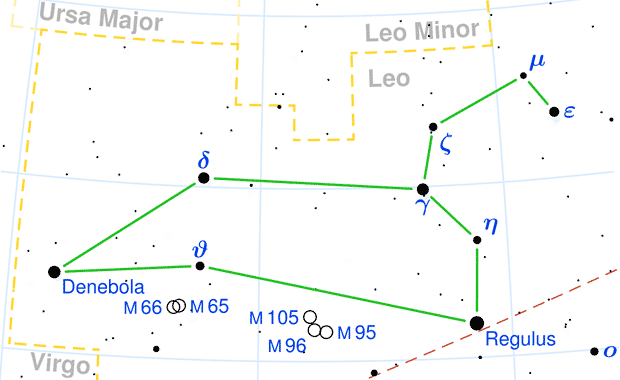
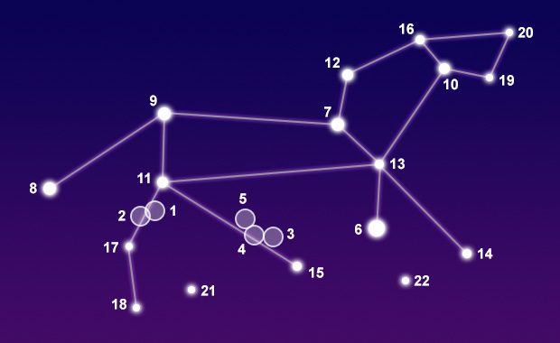

## [LEO](http://www.seasky.org/constellations/constellation-leo.html)
### Date range: July 23 - August 22

The constellation Leo, the lion, can be seen in the northern hemisphere in the spring. It is visible at latitudes between 90 degrees and -65 degrees. It is a large constellation covering an area of 947 square degrees. This makes it the 12th largest constellation in the night sky. It is bordered by the constellations Cancer, Coma Berenices, Crater, Hydra, Leo Minor, Lynx, Sextans, Ursa Major and Virgo. Leo is one of the thirteen constellations of the zodiac. This means it lies along the path the Sun travels in the sky during the year. It is easily recognizable in the night sky due to its many bright stars and distinctive shape.

Leo is one of the 48 constellation first identified by the Greek astronomer Ptolemy in the second century. Its name means “lion” in Latin. It is one of the oldest constellations in the sky. The ancient Mesopotamians may have had a constellation similar to Leo as early as 4,000 BC. The Persians called it Shir, and the Babylonians knew it as the Great Lion. The ancient Egyptians worshiped Leo as the place where the Sun rose after creation. It appearance in the night sky coincided with the summer solstice and the flooding of the Nile river. In Greek mythology, it was named after the Nemean lion, which was killed by Hercules on the first of his twelve labors for the king of Mycenae. According to legend, the lion had a hide that could not be pierced by iron, bronze, or stone. Hercules strangled the great beast after unsuccessfully trying to reason with it.

|Object|Designation|Name/Meaning|Object Type|V Mag|
---:|:---:|:---:|:---:|:---:
1|M65|N/A|Spiral Galaxy|9.30
2|M66|N/A|Spiral Galaxy|8.90
3|M95|N/A|Spiral Galaxy|9.70
4|M96|N/A|Spiral Galaxy|9.20
5|105|N/A|Elliptical Galaxy|9.30
6|Regulus|"Heart of the Lion"|Multiple Star System|1.36