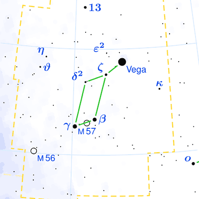
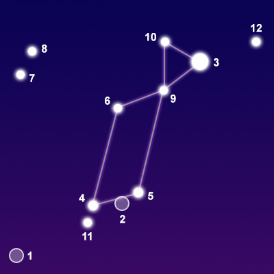

## [天琴座 Lyra](http://www.seasky.org/constellations/constellation-lyra.html)
The constellation Lyra, the lyre, is best seen from June through October in the northern hemisphere. It is visible between latitudes 90 degrees and -40 degrees. It is a small constellation, covering an area of 286 degrees of the sky. It ranks 52nd in size among the 88 constellations in the night sky. It is bordered by Vulpecula to the south, Hercules to the east, Draco to the north, and Cygnus to the west. Vega, the brightest star in Lyra, forms a large triangle with two other stars, Altair in Aquila and Deneb in Cygnus. This prominent formation of bright stars is known as the Summer Triangle. Lyra is also the origin point for the annual Lyrids meteor shower which occurs every year in April.

Lyra is one of the 48 constellations listed by the Greek astronomer Ptolemy in the second century. It represents the lyre, a musical instrument with strings that resembles a harp. It is associated with the myth of the Greek musician Orpheus. The lyre was invented by Hermes as a gift to his half-brother Apollo, who gave it to Orpheus, the musician of the Argonauts. Orpheus was so gifted with his music that even inanimate objects such as trees, streams, and rocks could be charmed. After his death, his lyre was thrown into a river. Zeus sent an eagle to retrieve it and both Orpheus and the Lyre were placed in the heavens as constellations.

|Object|Designation|Name/Meaning|Ojbect Type|V Mag|
---:|:---:|:---:|:---:|:---:
1|M56|N/A|Blobular Star Cluster|8.30
2|M57|Ring Nebula|Planetary Nebula|8.80
3|Vega|"Falling Eagle"|Blue Subgiant Star|0.03
4|Sulafat|"The Turtle"|Blue Giant Star|3.24
10|Epsilon Lyrae|N/A|Multiple Star System|4.70