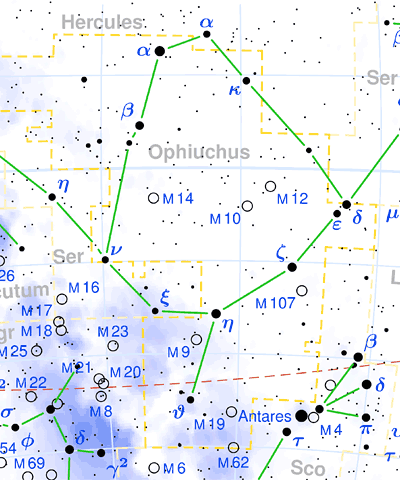
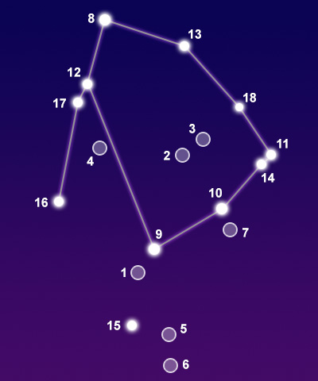

## [蛇夫座 Ophiuchus](http://www.seasky.org/constellations/constellation-ophiuchus.html)

The constellation Ophiuchus, the snake bearer, is best seen in summer in the northern hemisphere and winter in the southern hemisphere. It is completely visible at latitudes between 80 degrees and -80 degrees. It is a large constellation covering 948 square degrees of the sky. This makes it the 11th largest constellation in the night sky. It is located between Aquila, Serpens and Hercules, northwest of the center of the Milky Way. The southern part lies between Scorpius to the west and Sagittarius to the east. It is one of the thirteen constellations of the zodiac. This means it lies along the path the Sun travels in the sky during the year. When the Babylonians invented the Zodiac about 300 years ago, it only contained 12 constellations. Because of the procession of the Earth's axis, the Sun now passes through Ophiuchus each year in December, making it a new member of the Zodiac by definition.

Ophiuchus is one of the 48 constellations listed by the Greek astronomer Ptolemy in the second century. It is an ancient constellation that has been known by many ancient cultures. The Babylonians knew it as the serpent-god Nirah. The ancient Greeks identified it as the god Apollo struggling with the giant snake that guarded the Oracle of Delphi. It is frequently associated with the Greek figure Asclepius, son of the god Apollo, who was said to be able to bring people back from the dead. Serpents were always associated with physicians, and this has given rise to the modern symbol for medicine. Ophiuchus is commonly depicted as a man holding a snake, represented by the nearby constellation Serpens.

|Object|Designation|Name/Meaning|Object Type|V Mag|
---:|:---:|:---:|:---:|:---:
1|M9|N/A|Globular Star Cluster|7.70
2|M10|N/A|Globular Star Cluster|6.60
3|M12|N/A|Globular Star Cluster|6.70
4|M14|N/A|Globular Star Cluster|7.60
5|M19|N/A|Globular Star Cluster|6.80
6|M62|N/A|Globular Star Cluster|6.50
7|M107|N/A|Globular Star Cluster|7.90
8|Rasalhague|"Head of the Serpent Charmer"|Binary Star System|2.07
9|Sabik|"The Preceding One"|Binary Star System|2.43
10|Han|Chinese State of Han|Blue Subgiant Star|2.57