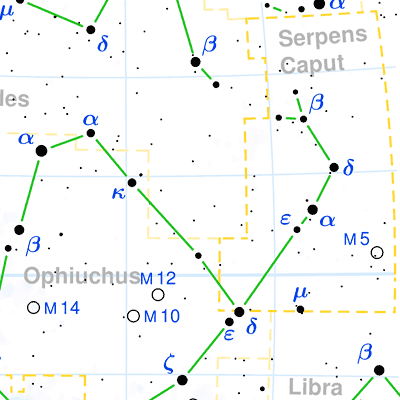
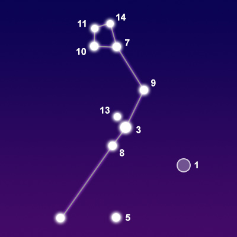
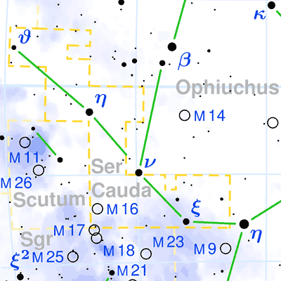
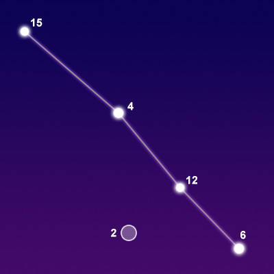

## [Serpens](http://www.seasky.org/constellations/constellation-serpens.html)

The constellation Serpens, the serpent, is best seen in the summer from the northern hemisphere. It is visible at latitudes between 80 degrees and -80 degrees. It is a mid-sized constellation with a total area of 637 square degrees. This ranks it 23rd in size among the 88 constellations in the night sky. Although this is officially one constellation, it is actually split into two distinct, disjoint areas of the sky. It is divided by the constellation Ophiuchus, the Serpent Bearer, who holds the serpent in his hands. These two areas are known as Serpens Caput (the head of the serpent) and Serpens Cauda (the tail of the serpent). This is the only constellation that is split in this fashion.

Serpens is one of the 48 constellations first listed by the Greek astronomer Ptolemy in the second century. Its name means “the serpent” in Latin. It is an ancient constellation that dates back to Babylonian times. It was one of two snake constellations at the time. In Greek mythology, Serpens represents a snake held by the healer Asclepius, which is represented by the constellation Ophiuchus. Asclepius was the son of the god Apollo and was said to be able to bring people back to life. He once killed a snake and saw it brought back to life by an herb that was placed on it by another snake.

|Object|Designation|Name/Meaning|Object Type|V Mag|
---:|:---:|:---:|:---:|:---:
1|M5|N/A|Globular Star Cluster|6.65
2|M16|Eagle Nebula|Diffuse Nebula|6.00