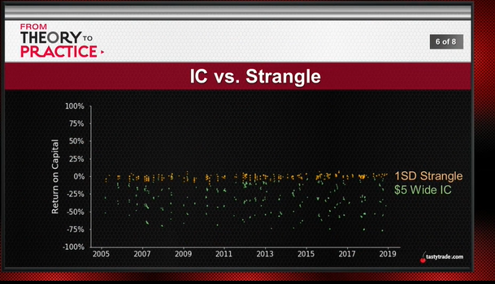

# [JUL 24, 2019](https://www.tastytrade.com/tt/shows/from-theory-to-practice/episodes/portfolio-tactics-building-blocks-capital-allocation-07-24-2019?_sp=1aa465be-9ad0-44d3-adc0-11df4a875468.1588202516076) 
## Divide and Conquer
* For every gimme, there's a gotcha:
  * Allocate a lot? -> higher returns, but higher rish
  * Allocate a little? -> lower returns, but lower risk
  * Allocate the "optimal" amount? -> still no guarantee
    * Where is the right balance of risk/reward...?
## Capital Allocation
   The amount of capital that is dedicated to certain positions in the portfolio normall presented in percentage terms
  1. Occurrences 
      |$100,000|25%|50%|75%|
      ---|---|---|---
      Capital Allocated|$25,000|$50,000|$75,000
      Positions|20|20-30|30+
      ---
      |$10,000|25%|50%|75%|
      ---|---|---|---
      Capital Allocated|$2,500|$5,000|$7,500
      Positions|5-10|10-15|15+
      ---
      |$15,000|25%|50%|75%|
      ---|---|---|---
      Capital Allocated|$3,750|$7,500|$11,250
      Positions|7-15|15-22|22+
  2. Risk/Reward
     * Position Size
        * More Capital ==> "Expensive" Position (UP & high price)
        * Less Capital ==> "Cheap" Position (DP * lower price)
     * Balance
        * More Capital ==> More Risk & Reward
        * Less Capital ==> Less Risk & Reward
     * Contrarian Style
        * More Capital ==> Low Price & High IV
        * Less Capital ==> High Price & Low IV
        * Short Market when price going higher, long Market when price going lower,
       Short more premium when IV is higher, short less when IV is lower
       Same amount capital can generate more occurrences at the market bottom, but more risk and less occurrence at top.
       bottom: 50%+, top: 25%
    * Under/Over-Allocated:
       
         75% capital wipe out all of money when market crash
  3. Dynamic: compare with stock, if you don't touch it, the percentage of portfolio won't change
      
  4. More capital = more flexibility:
    * higher # positions
    * greater # occurrences
    * more adjustment opportunitiesk
      |16 Δ|$5Wide IC|$10 Wide IC|Strangle|
      ---|---|---|---
      Full Loser|4%|2%|0.6% (2008)
   * 4% chance you'll have full-lose $5 IC, 0.6% you'll have full-lose in Strangle
   * Partial Loser
      |16 Δ|$5Wide IC|$10 Wide IC|Strangle|
      ---|---|---|---
      Partial Loser|18%|17%|17%
   * SPY size ($250-$300, $10 wide IC is synctial to Strangle, $100 => $5 )
   
   * maximum # of strangle is -12.5%
   * higher volatility on defined underline, lower volatility on naked position
   * Small: 75% Defined, 25% Undefined
   * Large: 25% Defined, 75% Undefined
   * conclusion: wider IC has similar percentage losing rate with strangle, the differece is losing return on capital. 

