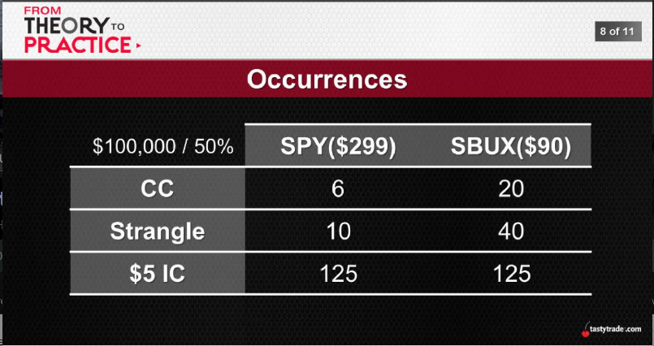
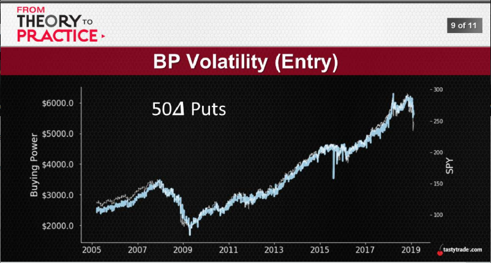
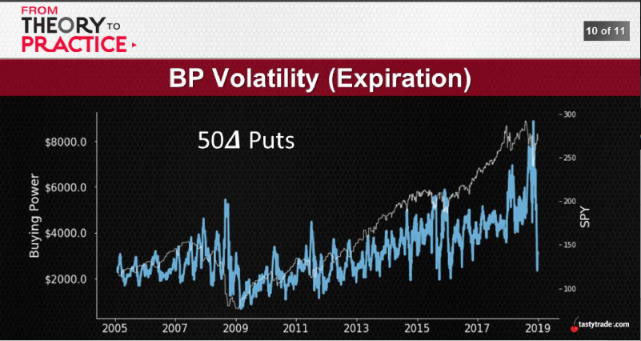
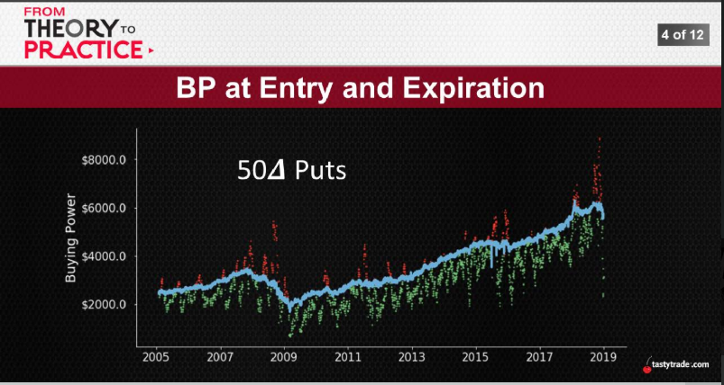
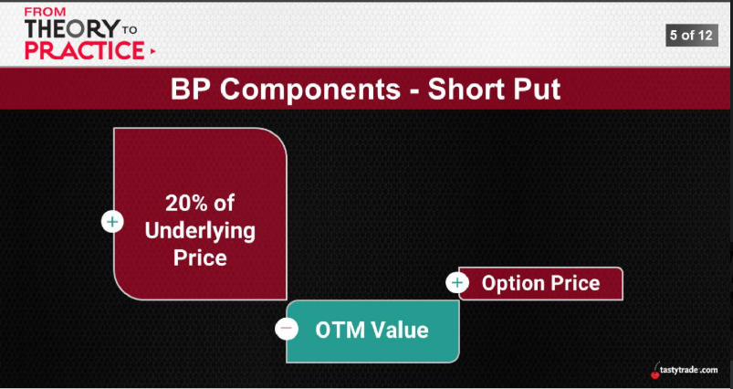
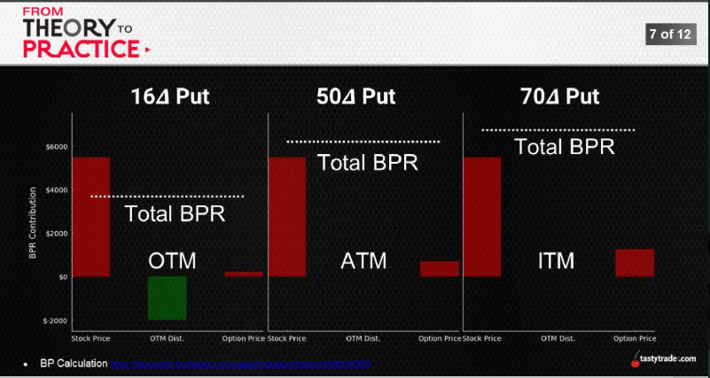
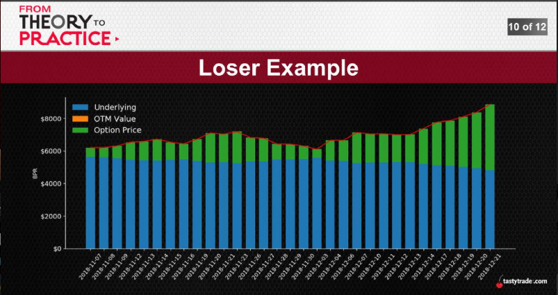
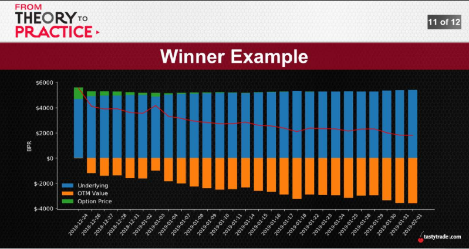

# [AUG 28, 2019](https://www.tastytrade.com/tt/shows/from-theory-to-practice/episodes/portfolio-tactics-building-blocks-buying-power-part-1-08-28-2019)
## Buying Power is more than meets the eye...
  The cash or securities an investor must deposit in his account as collateral before writing/selling option positions.
1. Risk
  * ITM vs OTM puts, OTM has less BP vs ITM ($4,500 vs $6,000)
  * Strangle Closer side (indices - Call side) has more risk
2. Occurrences
  * use 50% Capital => 25 Underlyings => 50 Positions
    
3. Volatility
  * BP could be doubled if your position deep ITM during the trade lifecycle
  
  
  
  
    
    
    
4. spy for same delta, call side always have more BP than put side, which side has more BP depends on skew