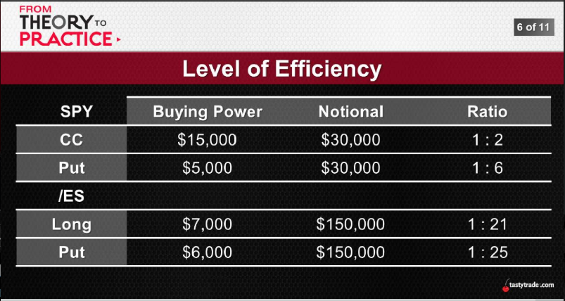
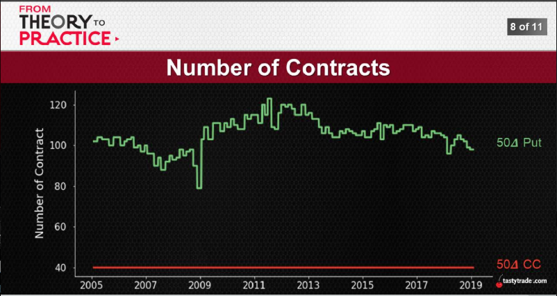
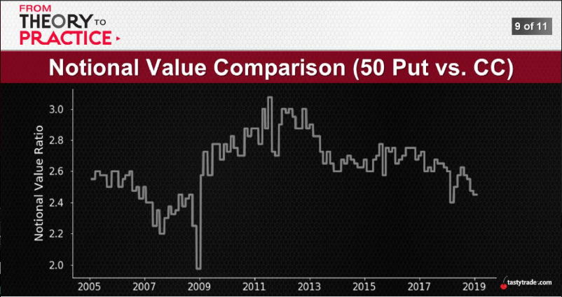

# [SEP 25, 2019](https://www.tastytrade.com/tt/shows/from-theory-to-practice/episodes/portfolio-tactics-building-blocks-notional-value-09-25-2019)
## Notional Value
  The notional value of a position is the real amount at risk, excluding margin relief.
  If we short 1 contract of an ATM SPY put at $300, we have $30,000($300x100) of notional value at risk.
* Notional Value -> the size of the position
* Position sizing -> more closely tied to BP than NV
* But... -> BP is determined by NV

  
  
  
  
  when market IV is low, BP is low, more trade placed, you carry more notional value = more risk & reward