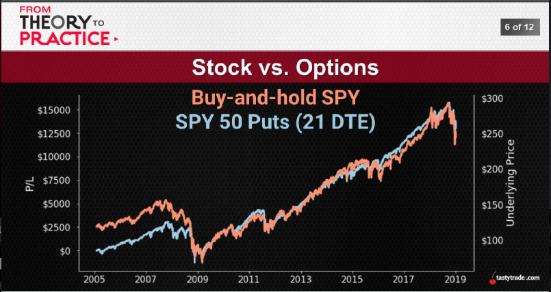
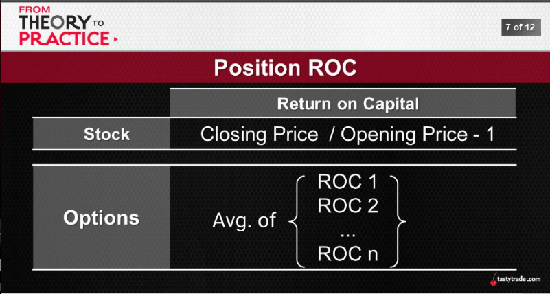
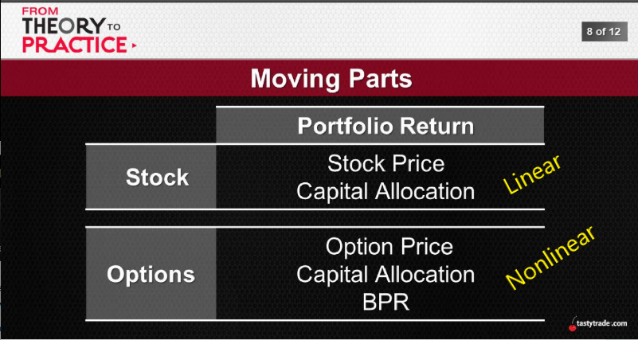
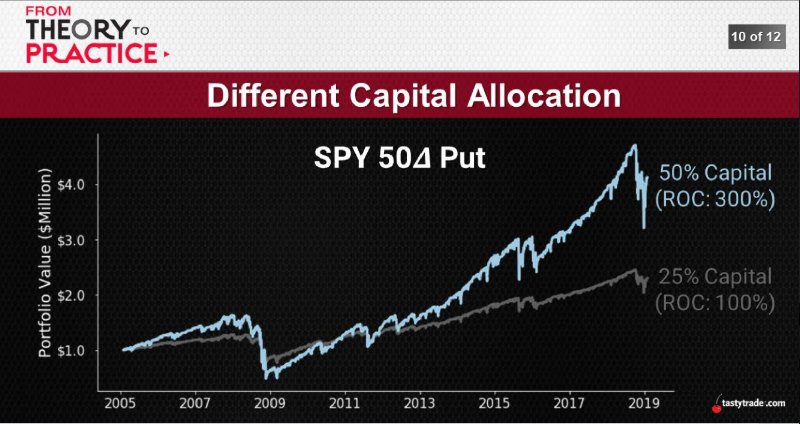
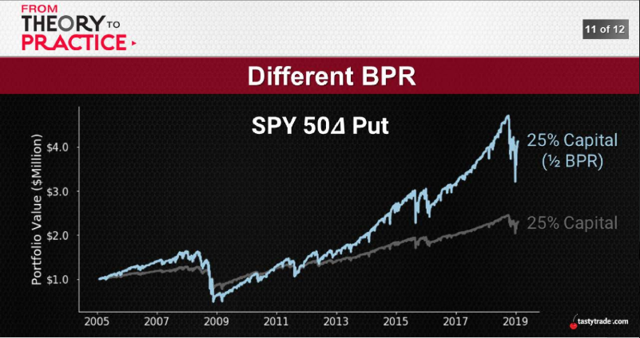

# [OCT 02, 2019](https://www.tastytrade.com/tt/shows/from-theory-to-practice/episodes/portfolio-tactics-building-blocks-portfolio-return-part-one-10-02-2019)
## Portfolio Return
## The Ultimate Objective
  * High POPs -> OTM short premium
  * Mechanical Adjustments -> turn losers into winners
  * Strategic Diversification -> different markets, different strategies

 This is are all pieces to the puzzle, but the puzzle itself is portfolio
## Return on Capital
  A measure of profitability after accounting for initial capital invested
1. Nonlinear

  
  
  
  
  