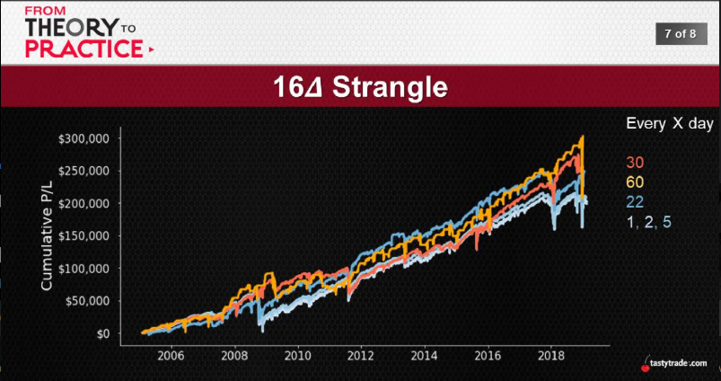

# [NOV 20, 2019](https://www.tastytrade.com/tt/shows/from-theory-to-practice/episodes/portfolio-tactics-building-blocks-number-of-occurrences-part-one-11-20-2019)

## This is the Key
 No, seriously... this is absolutely critical:
* Probabilities -> requirement and necessity
* In the short-term? -> randomness and noise
* But in the long-term? -> smoothed out results

The path to consistency is littered with data points...
  
  

## A Convergence of Profits
 If we want expected results -> realized results...
 * Need occurrences -> gotta feed the beast
 * In short-term? -> anything can happen
 * But over long-term? -> things play out as expected

 If, and only if, we give the math a chance...
  
  
  
