# [DEC 18, 2019](https://www.tastytrade.com/tt/shows/from-theory-to-practice/episodes/portfolio-tactics-building-blocks-implied-volatility-part-one-12-18-2019)

## The GateKeeper
As tastytraders, Implied Volatility is standing at the door...
 * Non-Directional -> NKA...not one.single.thing
 * Follows option prices -> it moves the 'juice'
 * Opportunity -> IVR Overstated, Mean Reversion. etc

Thus, this one metr thows up in a myria

## Implied Volatility
 A number calculated based on OTM options market prices. SPX OTM options Prices => VIX

  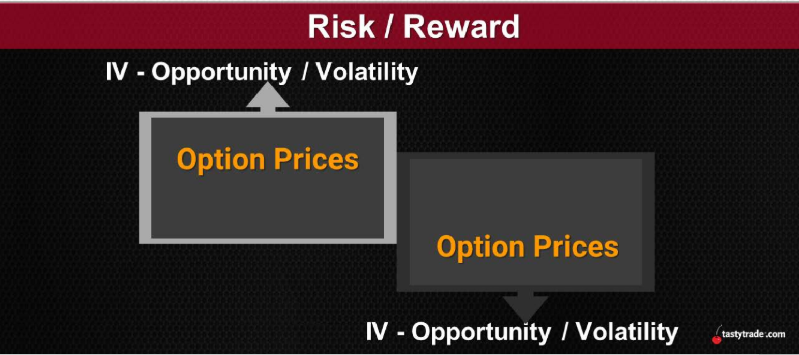
  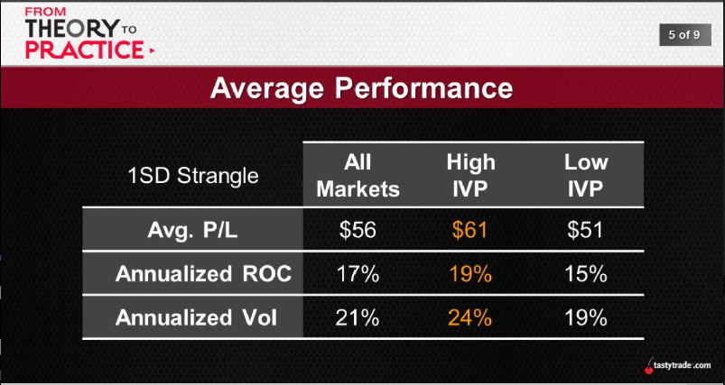
  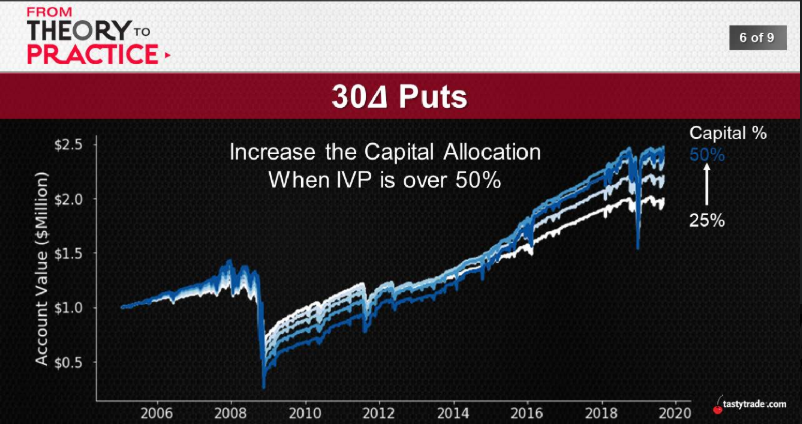
  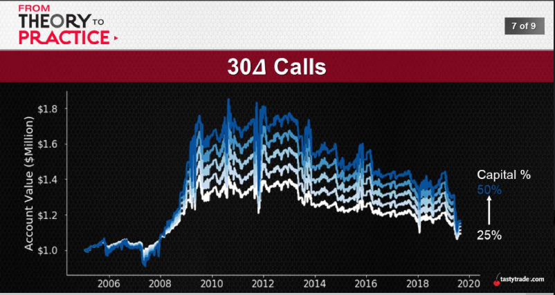
  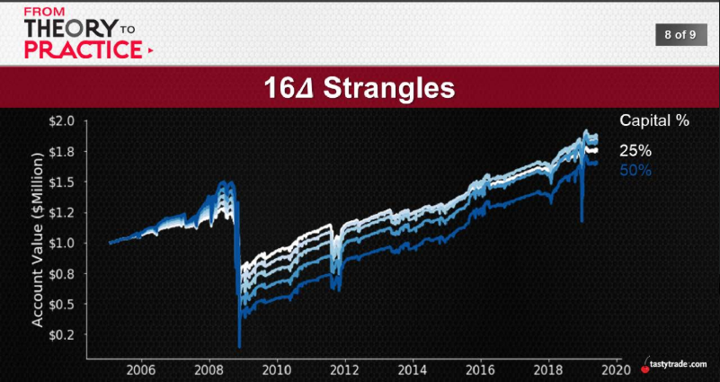

IVP > 50% is more important compare with IVR > 50%

## The Importance of IV
IV continues to play a critical role in our portfolio construction:
* 'Raw' Form? -> IV fed into BSM to determine prices
* 'Rank' Form? -> where is IV... relative to IV?
* 'Reverting' Form? -> contraction and expansion

But is there potentially even more to the story...?
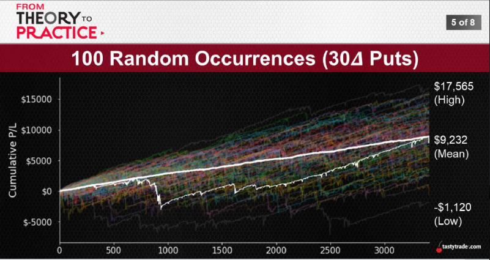
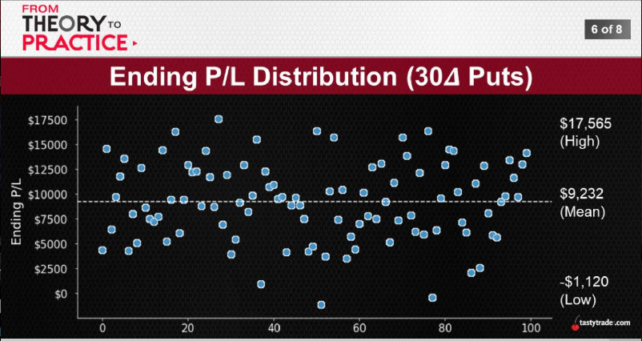
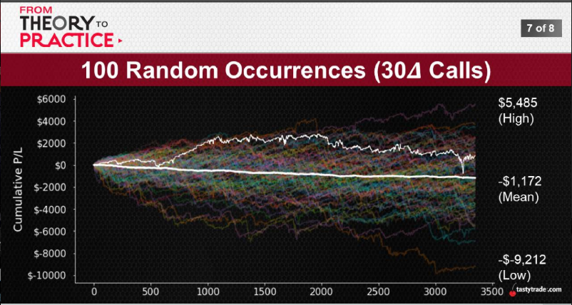

if like most people pick 16delta strangle, could make more money

## The Full Monte
The road less traveled:
 * Rudimentary IV -> IV's impact on option prices
 * Ranks/Percentiles -> IV's relative standing
 * Randomness? -> loss in some Monte Carlo Analysis

How do the Monte Carlo results change with IV...?

  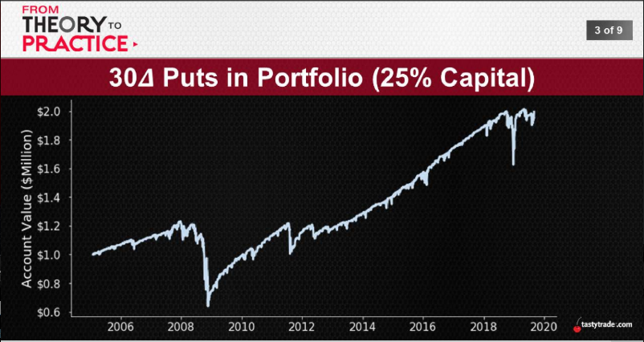
  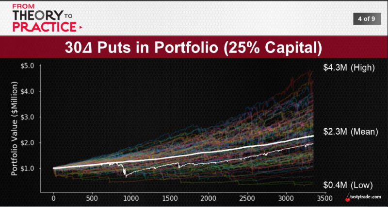
  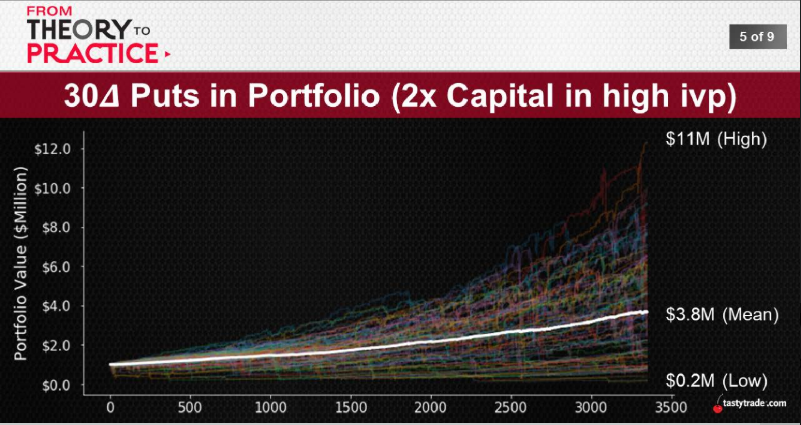
  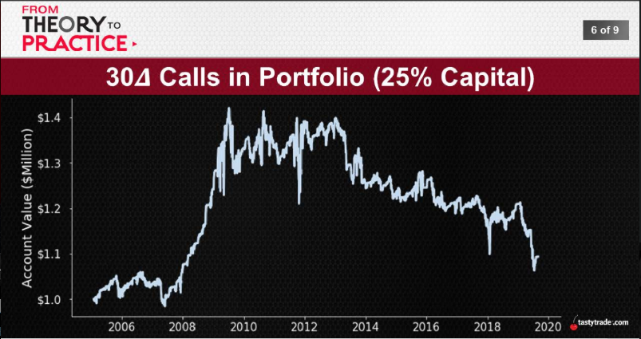
  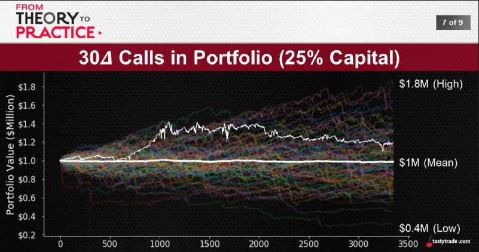
  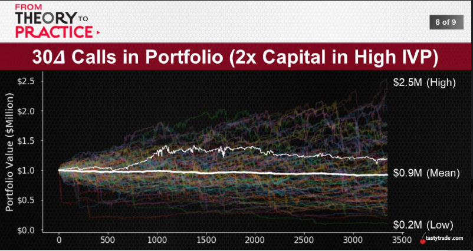

double the capital when IVP>50%, when you're right, you get more money, when you're wrong, you won't lose more money
