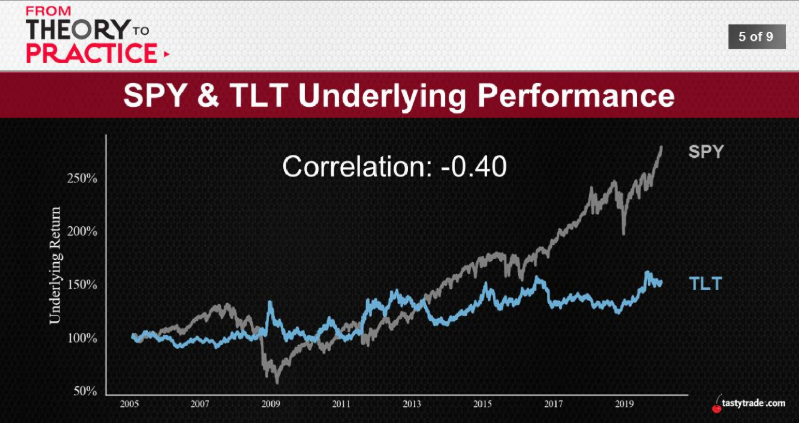
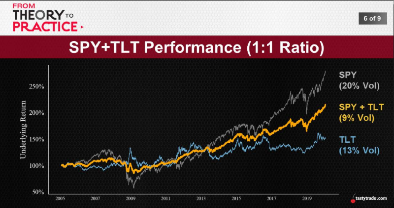
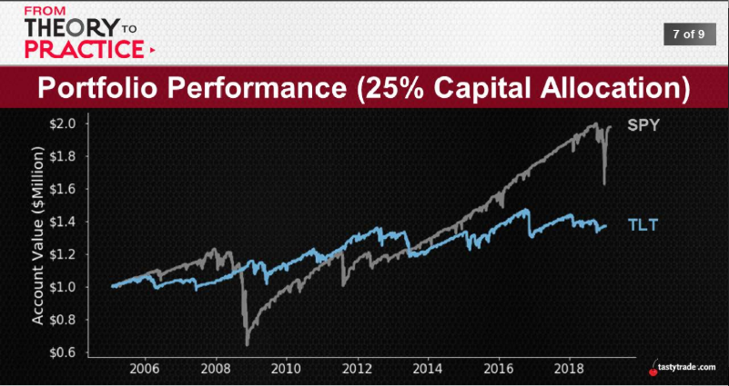
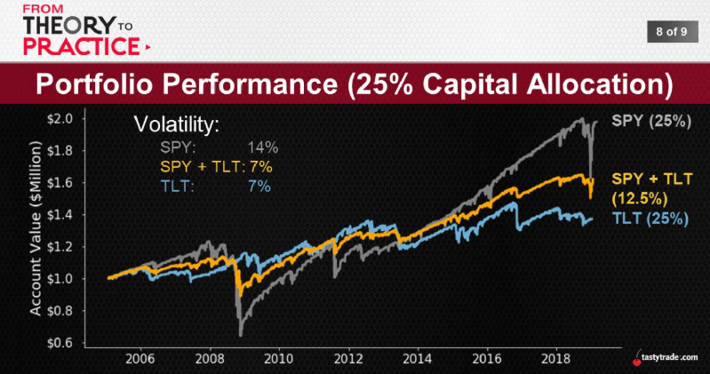
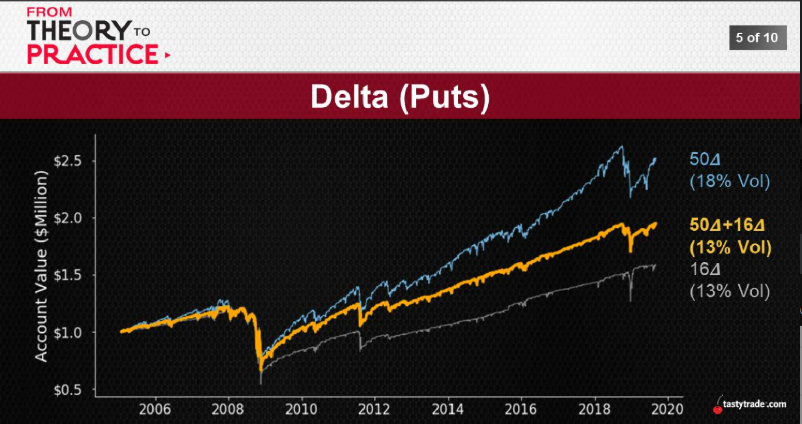
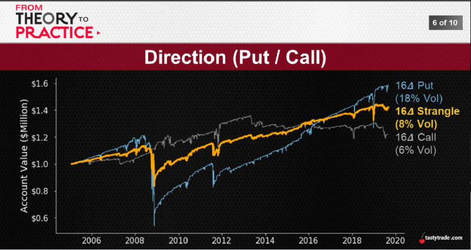
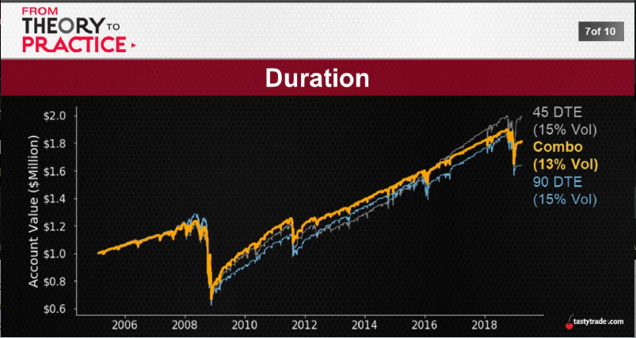
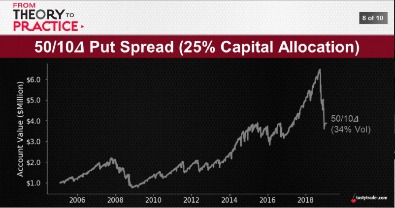
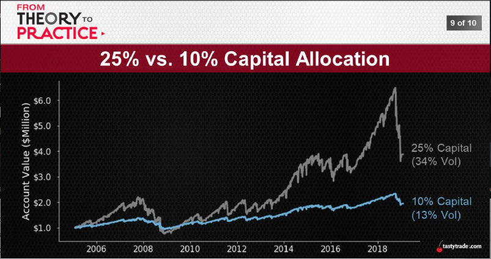

# [JAN 22, 2020](https://www.tastytrade.com/tt/shows/from-theory-to-practice/episodes/portfolio-tactics-building-blocks-diversification-part-one-01-22-2020)

## Diversifying Diversification
It's more than we thought:
* Asset -> unconrrelated assets
* Positions -> across type, across strategy
* Time/Mechanics -> different DTEs = different mgmt

So, how does all of this begin to fit inside a portfolio...?

## Diversification 
  One way to balance risk and reward in a portfolio is by diversifying across assets. SPY vs. SPY + TLT
  1. Assets
  2. Positions
  3. Mechanics

  
  

  most important part isn't the P/L is in the middle, it's reduce the VOL to below even average.
  
  

  maximum reduced Vol to lower end 

* Start: Assets -> multiple eggs, multiple baskets
* Classic Approach -> stocks and bonds
* Individual Positions? -> deltas, durations, ets.

Time to break out the scalpel...

  2. Positions level
      1. Delta
      2. Direction
      3. Duration
      
  
  
  
  
  
