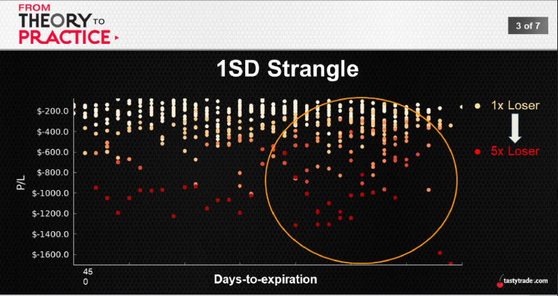

## Managing Losers
* Part 1: Average Performance
* Part 2: Long-Term Performance
* Part 3: Volatility and Risk
 
     

    |1 SD Strangle|Exp.|1X|2X|3X|4X|5X|
    ---:|:---:|:---:|:---:|:---:|:---:|:---:
    % of Occu.|63|21%|11%|6%|4%|2%
    Biggest Loss|-$2,485|-$691|-$1,083|-$1,245|-$1,690|-$1,690
    Avg. P/L|$63|$54|$59|$57|$56|$58
    Win Ratio|83%|74%|80%|82%|82%|83%
    Duration|44|39|41|42|42|43
    Daily P/L|$1.49|$1.40|$1.46|$1.39|$1.37|$1.38
