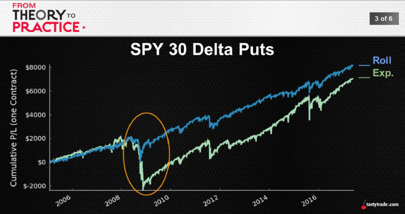
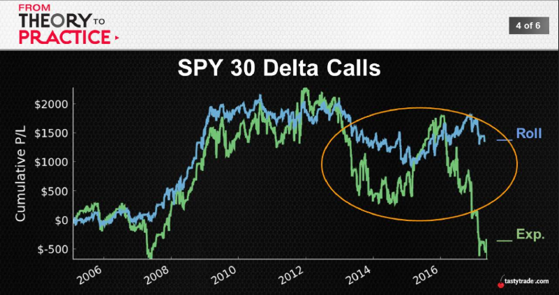
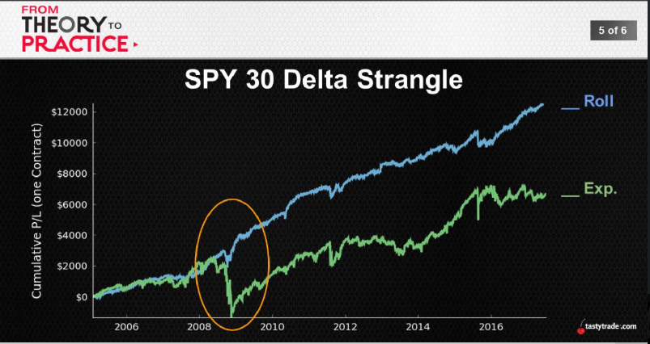

## Rolling

Results: Without Rolling
|30Δ Put|When Tested|
:---:|:---:
Total Occurrences|2,977
\# of Tested Occurrences|1,343 (45%)
Avg. P/L|-$116
Avg.Duration|17 days
Largest Loss|-$918

Results: With Rolling
|30Δ Put|Roll Until Profitable|
:---:|:---:
\# of Tested Occurrences|1,343 (45%)
Avg. P/L after Rolls|$98
Avg. \# of Rolls|3
Highest \# of Rolls|17
Avg. Holding Duration|104 days
Longest Holding Duration|686 days

  
  
  
  being wrong for eleven years to shot call, you still making money if you roll
  