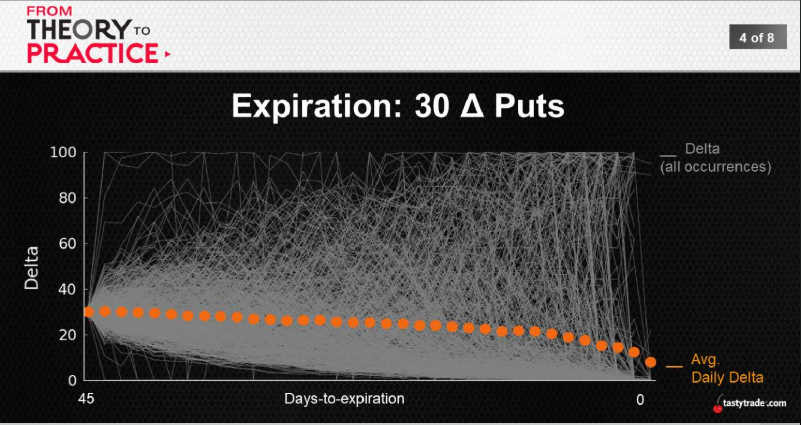
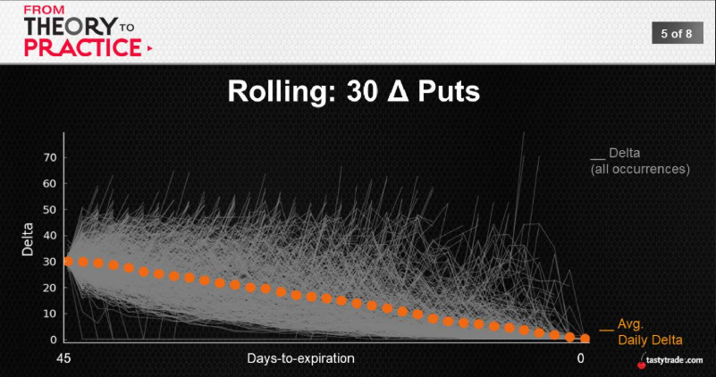
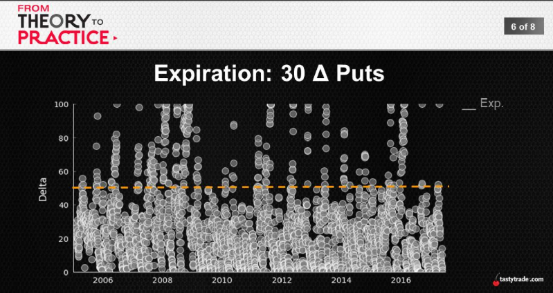
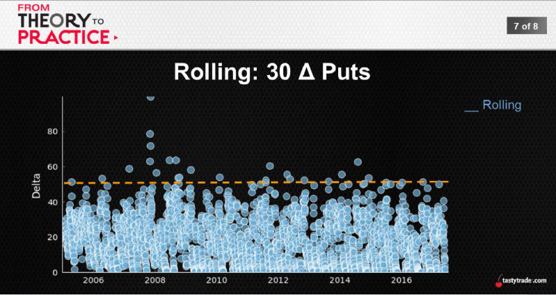
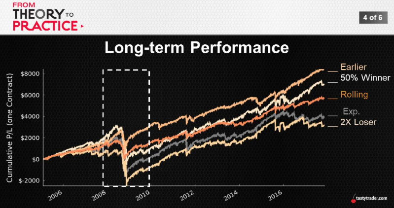
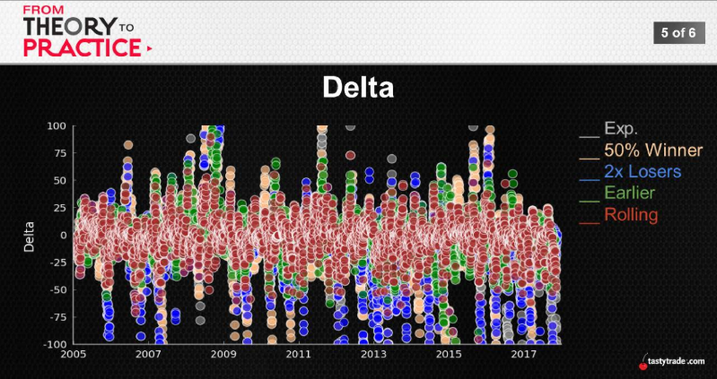

## Rolling

Results: Without Rolling
|30Δ Put|When Tested|
:---:|:---:
Total Occurrences|2,977
\# of Tested Occurrences|1,343 (45%)
Avg. P/L|-$116
Avg.Duration|17 days
Largest Loss|-$918

Results: With Rolling
|30Δ Put|Roll Until Profitable|
:---:|:---:
\# of Tested Occurrences|1,343 (45%)
Avg. P/L after Rolls|$98
Avg. \# of Rolls|3
Highest \# of Rolls|17
Avg. Holding Duration|104 days
Longest Holding Duration|686 days

  
  

  being wrong for eleven years to shot call, you still making money if you roll
  

|SPY|Put Exp.|Put Roll|Call Exp.|Call Roll|Strangle Exp.|Strangle Roll|
---:|:---:|:---:|:---:|:---:|:---:|:---:
Largest Loss|-$3,157|-$918|-$1,404|-$510|-$2,485|-$1,050

  
  
  
  

## Series Takeaways
* Offensive Tactics
  * Managing Winners (50%) -> strong support
  * Managing Early (22/23 DTE) -> surprising promise
* Defensive Tactics
  * Managing Losers (2x) -> inconsistent results
  * Rolling (strike tested) -> the terifecta (ave, long, vol)

|Winners|Earlier|Loser|Rolling|
---|---|---|---
* Increased success rate * Reduced duration * Increased ROC|* Reduced duration and volatility * Smoothed out profitability  |* Limited large losses   |* Reduced losses and volatility   

|1 SD Strangle|Expiration|50% Winners|Earlier|2X Loser|Rolling|
---:|:---:|:---:|:---:|:---:|:---:
Avg. P/L|**$64**|$38|$41|$59|
Win Ratio|83%|**91%**|82%|80%|
Duration|44|23|23|41|
Daily P/L|$1.49|$1.65|**$1.78**|$1.4|
Biggest Loss|-$2,485|-$2,485|-$1,976|-$1.083|**-$918**

  
  
