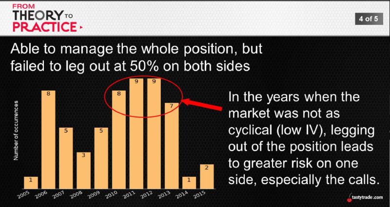

## The Logic Chain
* It seems to make sense (marketplace cyclicality)
* Inside of trade -> manage winning side independently
* "On as a package, off as a package..."

Frequency Breakdown: No Leg vs Leg
|1 SD Strangle|Able to Manage Whole Position|Able to Leg Out|
---|:---:|:---:
% of Occurrences|90%|86%

Average Performance: No Leg vs Leg
||Manage Whole Position at 50%|Leg Out at 50%|
---|:---:|:---:
% Profitable|90%|89%
Avg. P/L Per Trade|$32|$30
Largest Loss|-$2,382|-$2,421

