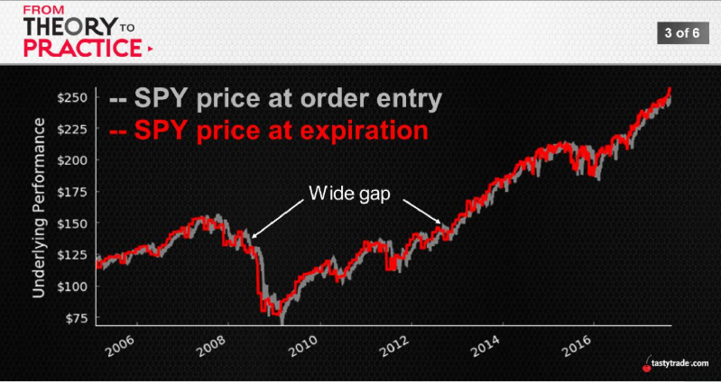
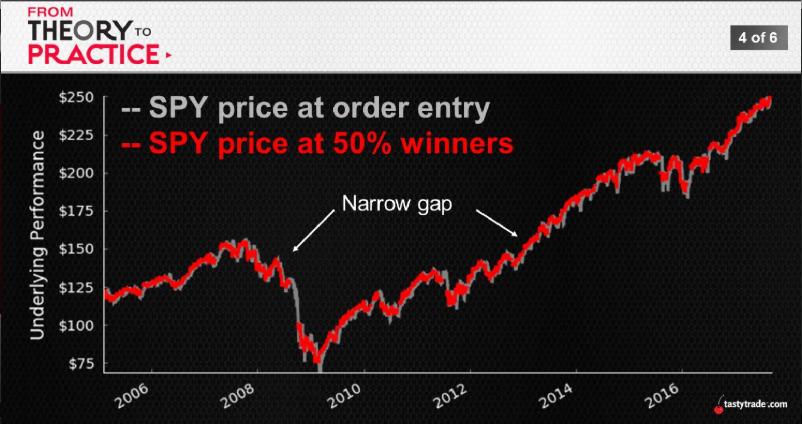
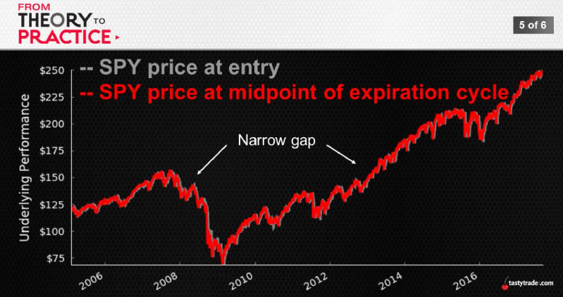

## Asymmetric Option Pricing
Options -> priced with a certain amount of 'skew' baked in 
  * Each strike stands alone
  * Volatility of that given price point

Where is the risk?
  * Directly related to and correlated with skew

 Side-by-Side Stats
|Stock Return|Expiration|50% Winner|
:---:|:---:|:---:
Avg.|+0.8%|+0.2%
Largest Up|+17%|+13%
Largest Down|-31%|-14%
Std. Deviation|5%|2%

 
 
  

 Manage early is amazing!!!