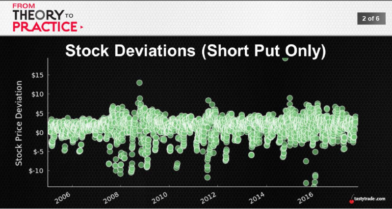
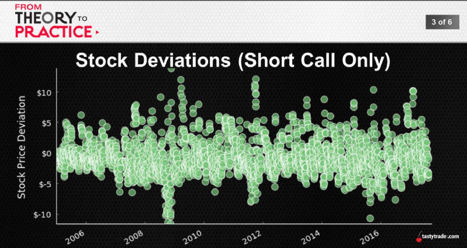
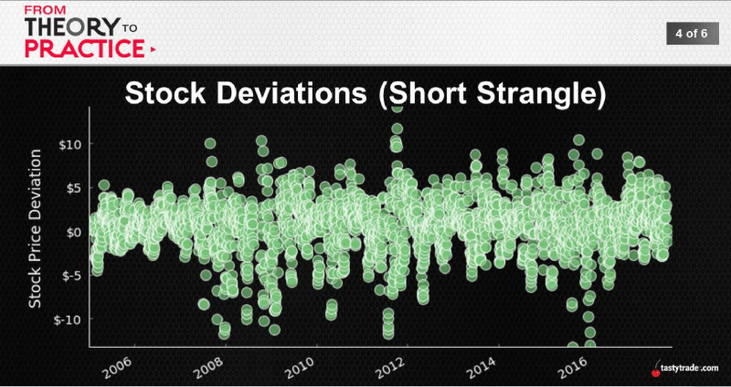

## Another Look at Deviations
Impact of Stock Deviation?
* Managing Winners -> Tighter ranges
* Add depth and detail to those results

A triage of Greeks
* Directional impoacts (delta)
* Time's movement (theta)
* Volatility changes (vega)

 
 
  

Average Stock Deviations
||16Δ Put|16Δ Call|1SD Strangle|
:---:|:---:|:---:|:---:
Avg. Deviation|+$1.18|-$0.69|+$0.61