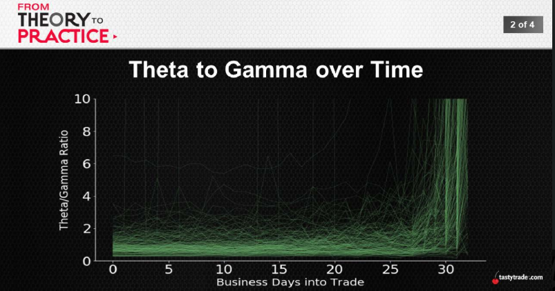
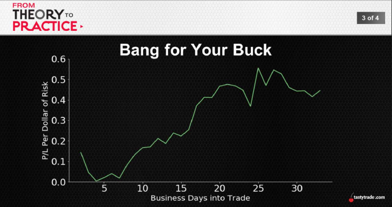

## Decay per Direction
Theta -> expands as we approach expiration
* Each day -> more decay (more valuable)
Gamma -> also expands as we approach expiration
* Each day -> more directional (less valuable)

Hmmm...expanding at the same rate???

 
 