## A Review of buying power basics
BPR ^ Higher Risk ^    
BPR v Lower Risk v

* OTM BPR = 20% of Underlying Price - OTM Value + Option Price
* ITM BPR = 20% of Underlying Price + ITM Value + Option Price

## Advanced Buying Power Analysis
* reviewd @ Sep 19 2020

  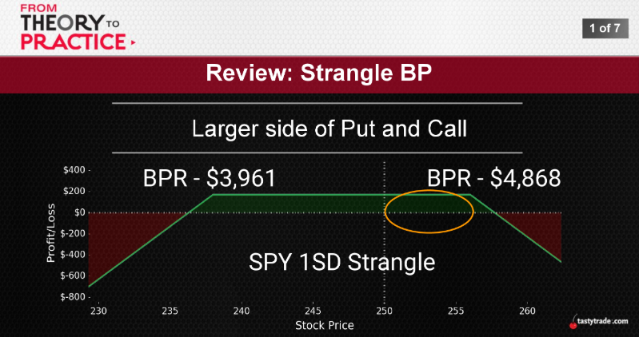
  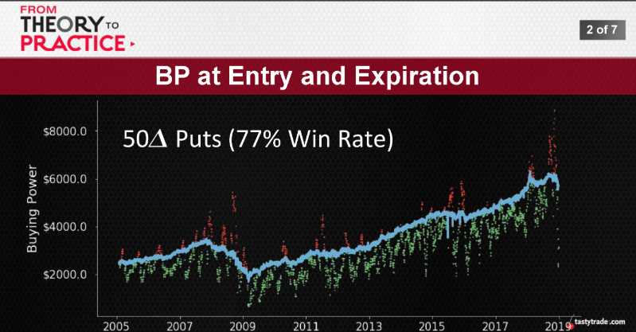
  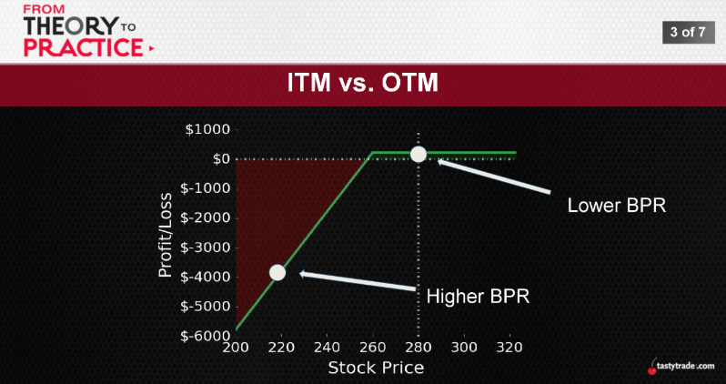
  
  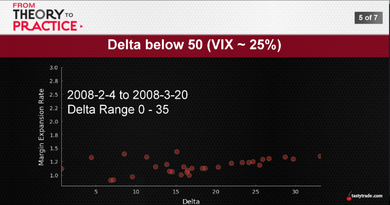
  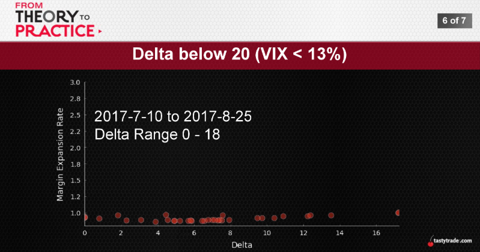
  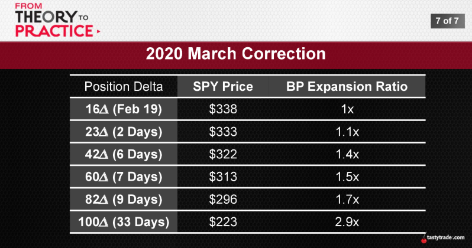

## BP Expansion at Expiration

  BP Expansion Ratio Example
  ||50Δ Put|
  :---:|:---:
  Original BPR|$5,000
  Ending BPR|$10,000
  BPR Expansion|+$5,000
  BP Expansion Ratio|2X

  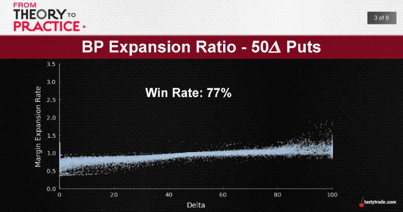
  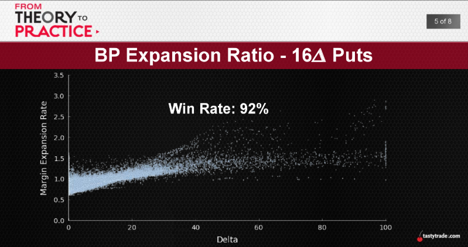
  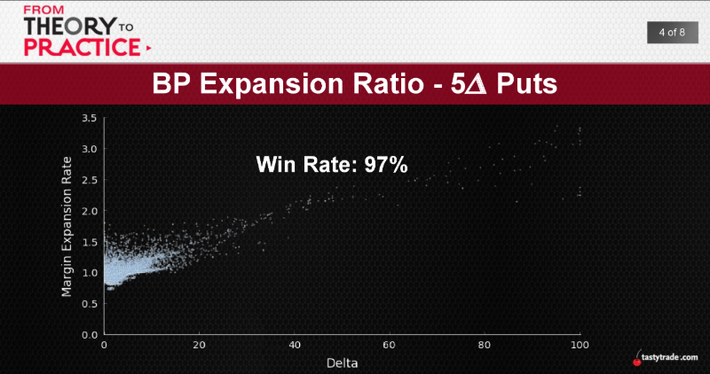
  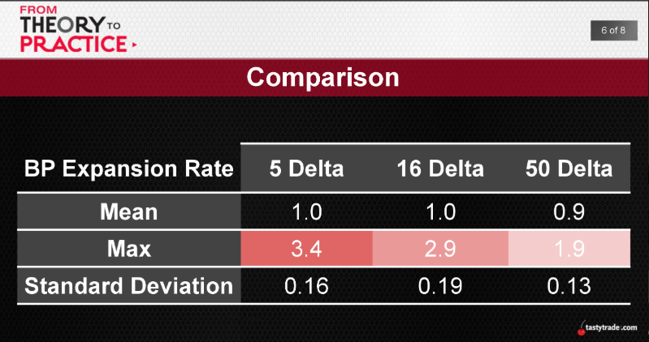
  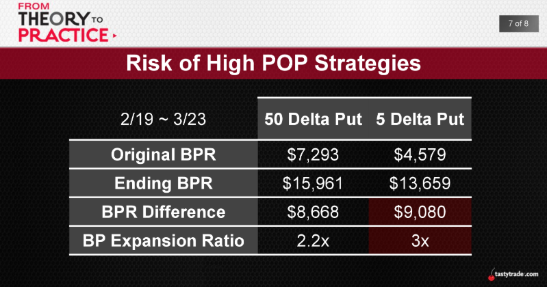

## A Deeper Dive into Buying Power
  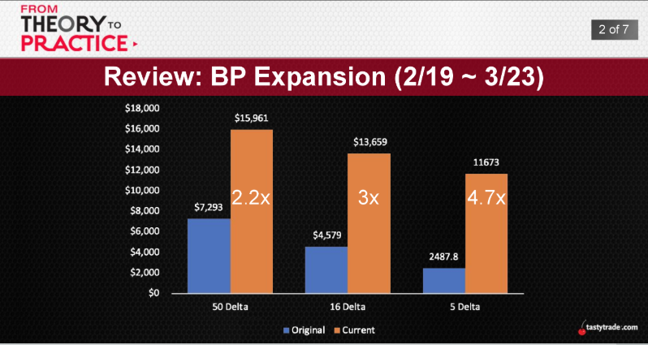
  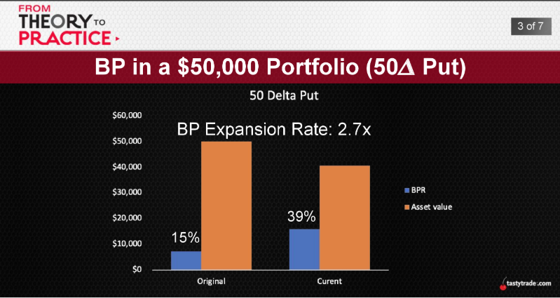
  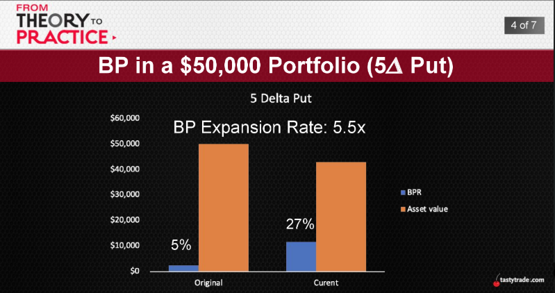

