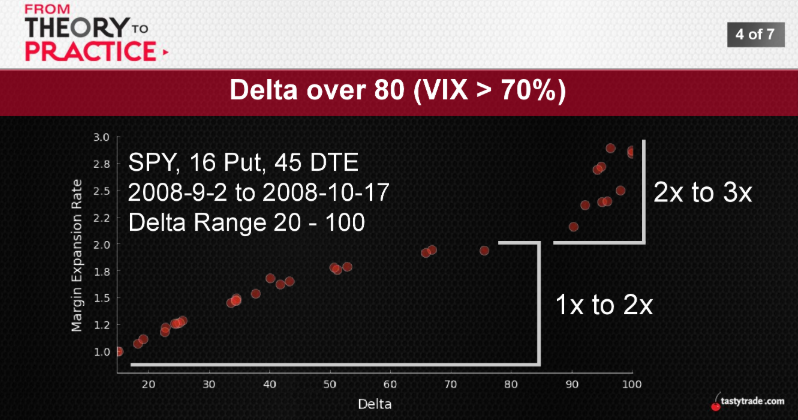

## A Review of buying power basics
BPR ^ Higher Risk ^    
BPR v Lower Risk v

OTM BPR = 20% of Underlying Price - OTM Value + Option Price
ITM BPR = 20% of Underlying Price + ITM Value + Option Price

## Advanced Buying Power Analysis

  
  
  
  
  
  
  
