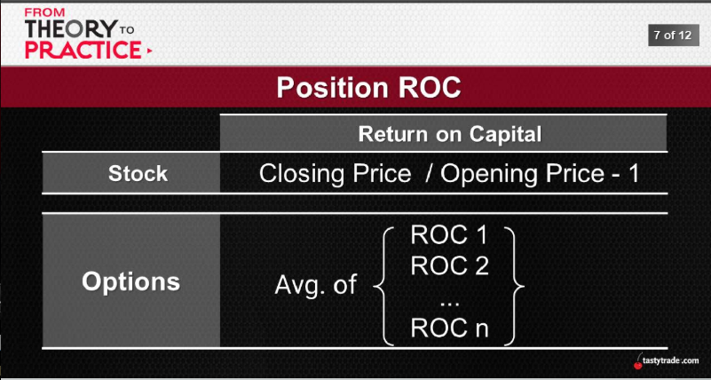
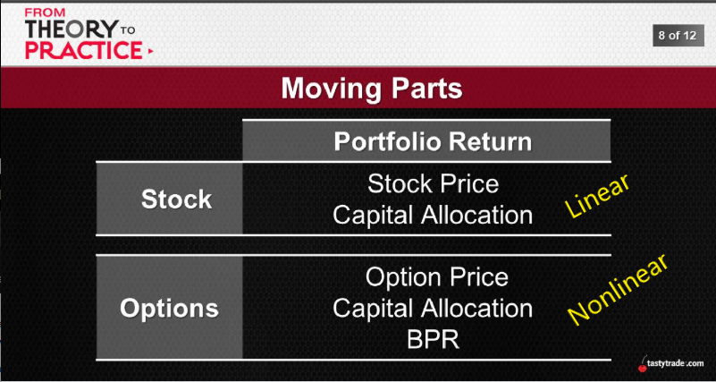

# [OCT 02, 2019](https://www.tastytrade.com/tt/shows/from-theory-to-practice/episodes/portfolio-tactics-building-blocks-portfolio-return-part-one-10-02-2019)
## Portfolio Return
## The Ultimate Objective
  * High POPs -> OTM short premium
  * Mechanical Adjustments -> turn losers into winners
  * Strategic Diversification -> different markets, different strategies

 This is are all pieces to the puzzle, but the puzzle itself is portfolio
## Return on Capital
  A measure of profitability after accounting for initial capital invested
1. Nonlinear

  
  
  
  
  

## When the Dust Settles
 We constantly compare expected outcomes with realized results:
  * IV vs RV -> implied volatility "overstated"
  * POP vs POP* -> ex ante and ex post*
  * ROC vs P/L -> ROC on way in, profit on way out

  So how do ROCs help inform eventual portfolio returns?

2. Expected vs. Realized

  
  
  

  wider the wings or lower delta reduce the volatility

  
  
  

  only 15% difference compare 50 delta straddle vs. 10 delta strangle

## Gimmes and Gotchas
 As we always like to say...
   * Portfolio Return -> ceteris paribus, higher = better
   * Portfolio Risk -> ceteris paribus, lower = better
   * Together? -> it's never that easy...especially with BP

   When we add capital allocation into the mix, how do things change...?

  
  
  
  
  
  

  at 30 delta call, you were wrong for 15 year, still making money

