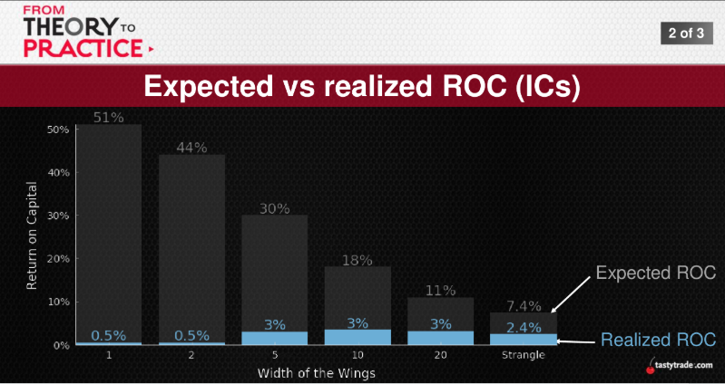
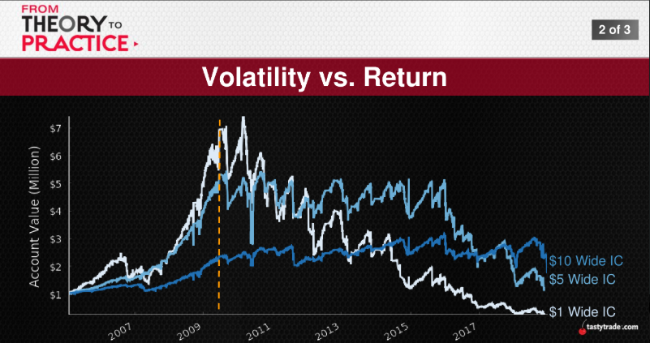
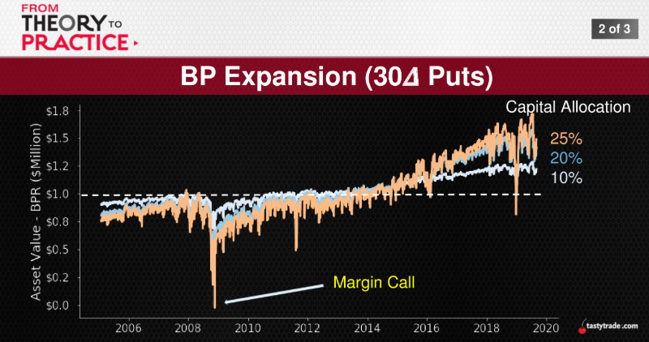
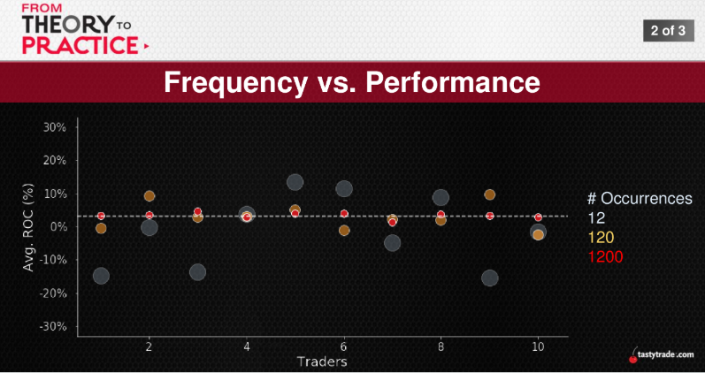

## The Goal
Profit (ROC) higher
   * Risk (Vol) lower
Over the last six months, we've covered a lot:
* Sheer Importance -> of portfolio management
* Capital Utilization -> how much money to put to use?
* Buying Power -> fluid and dynamic

So let's take a trip down memory lane...

  
  
    
      

  always is Dynamic

  * Portfolio Risk/Return -> is anything more important?
  * POPs and Obs -> we've got to feed the beast...!
  * Diversifying Diversification -> asset, position, mechanics

  The end of an era...

  
  
    
      
  
  ### Assets
  ### Positions
  ### Mechanics