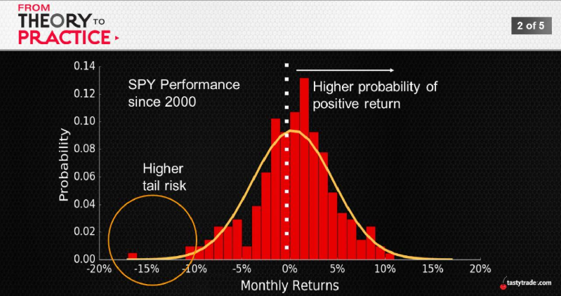
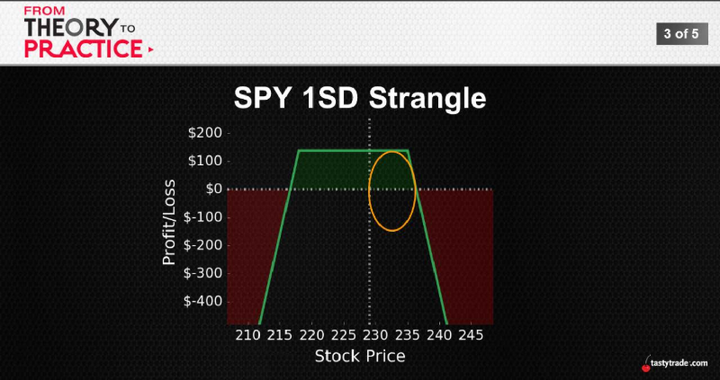

## Downside Velocity
The theoretical premise makes sense:
 * Markets fall -> volatility spikes
 * Higher volatility = more uncertainty
 * Most investors dislike uncertainty -> more selling
 * Panic sets in and selling accelerates
## Price Impact Asymmetry"
 * Bids in bears more aggressively than asks in bulls

 
 

 Side-by-Side Stats
|Stock Return|Expiration|50% Winner|
:---:|:---:|:---:
Avg.|+0.8%|+0.2%
Largest Up|+17%|+13%
Largest Down|-31%|-14%
Std. Deviation|5%|2%