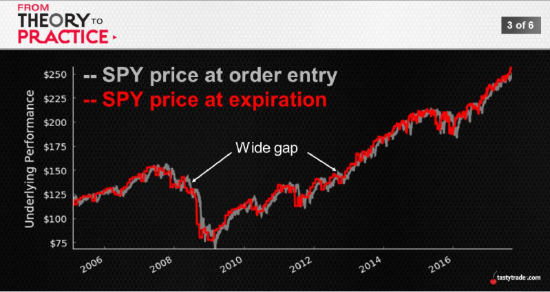
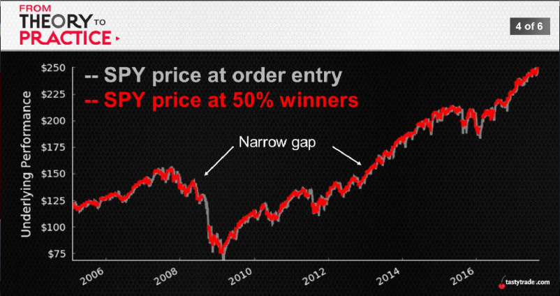
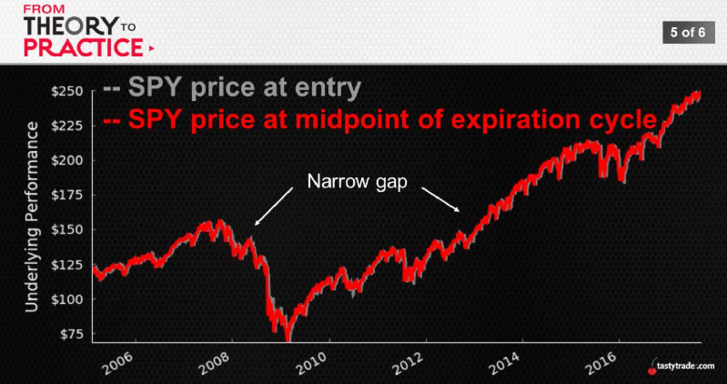
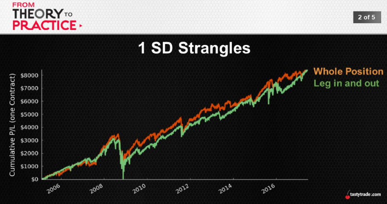

## Asymmetric Option Pricing
Options -> priced with a certain amount of 'skew' baked in 
  * Each strike stands alone
  * Volatility of that given price point

Where is the risk?
  * Directly related to and correlated with skew

 Side-by-Side Stats
|Stock Return|Expiration|50% Winner|
:---:|:---:|:---:
Avg.|+0.8%|+0.2%
Largest Up|+17%|+13%
Largest Down|-31%|-14%
Std. Deviation|5%|2%

 
 
  

 Manage early is amazing!!!

## From Stock to Options
without skew, a deviation from original stock price has the same impact on the put and call prices in percentage terms (both +/- 10%), However, with skew, a deviation from the original stock price requires a greater change on the call price than the put price in percentage terms (10% vs. 20%).

 

 Success Rate
||16Δ Put|16Δ Call|1SD Strangle|
:---:|:---:|:---:|:---:
Theoretical|84%|84%|68%
Expiration|93%|85%|83%
50% Winner|96%|91%|91%

 Duration to Reach 50% Winner
||16Δ Put|16Δ Call|1SD Strangle|
:---:|:---:|:---:|:---:
Avg. Duration (days)|14|17|22
Proportion that Hits  50% Winner First|50%|49%|1%

