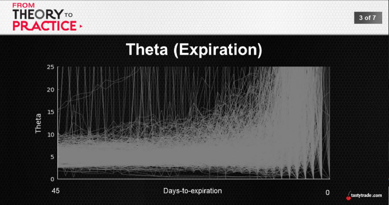
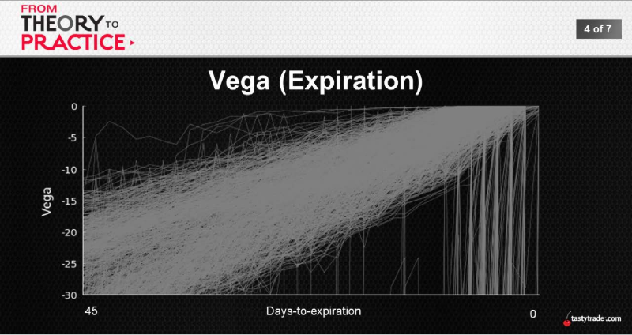
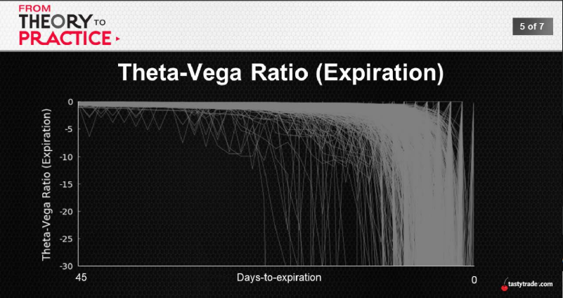
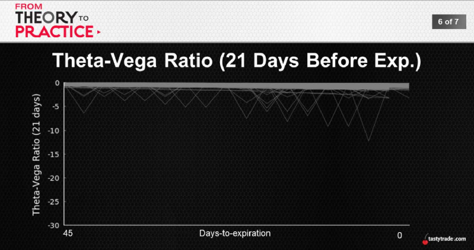

## Theta Implications
Theta -> option's decay per change in time (day)
* Intuitive result -> from long's perspective
* Why we do what we do -> tastytrade philosophy

But, this is only theta in isolation

## Vega Implications
Vega -> option's change per change in volatility (IV)
* Not one-sided certainty -> option up or down
* IV expansion -> option prices will pop
* IV contration -> option prices will drop

Easy enough, but this is vega independently

 
 
  
  