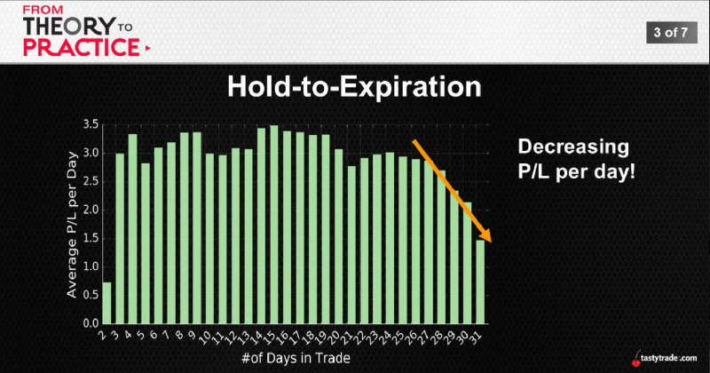
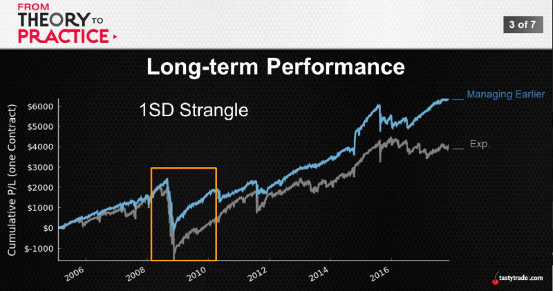
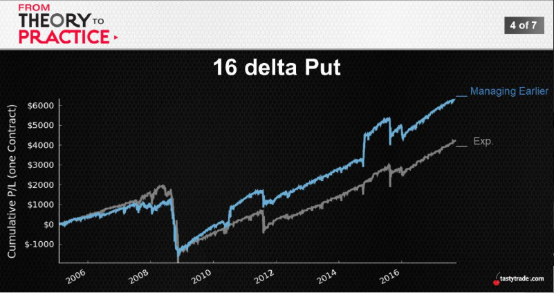
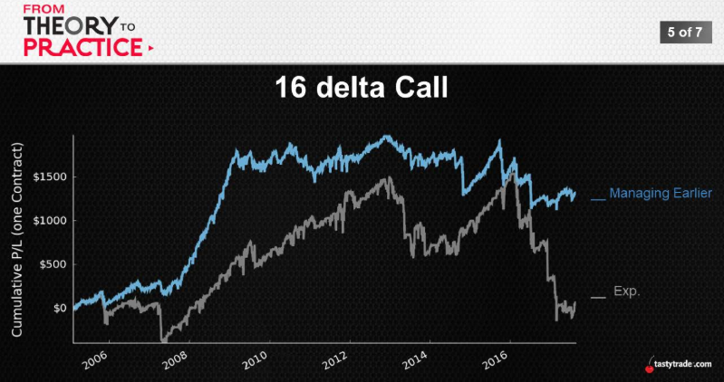
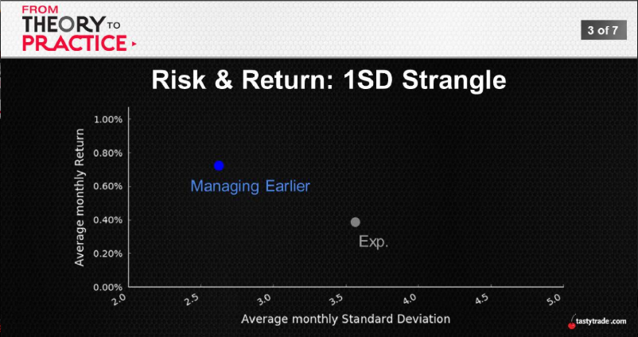
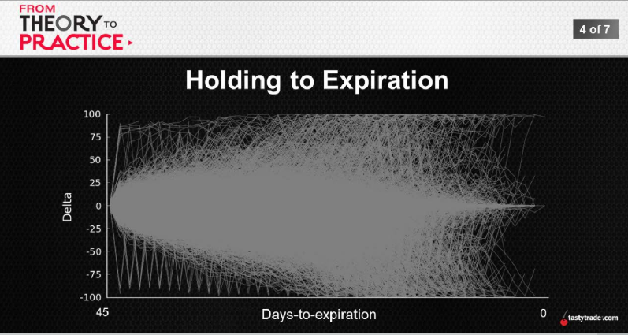
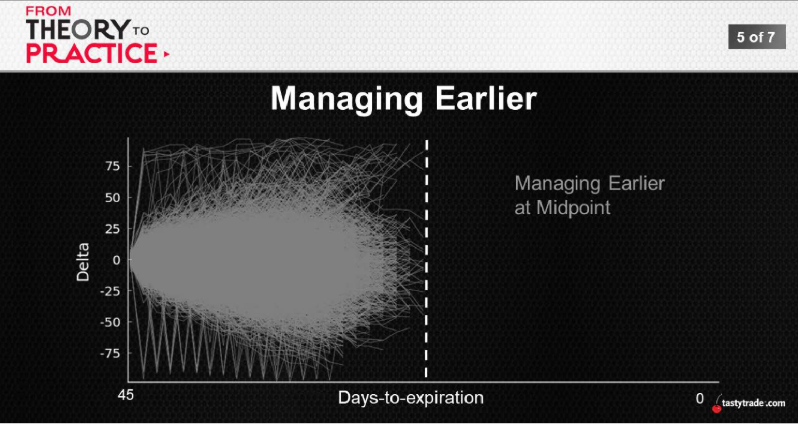
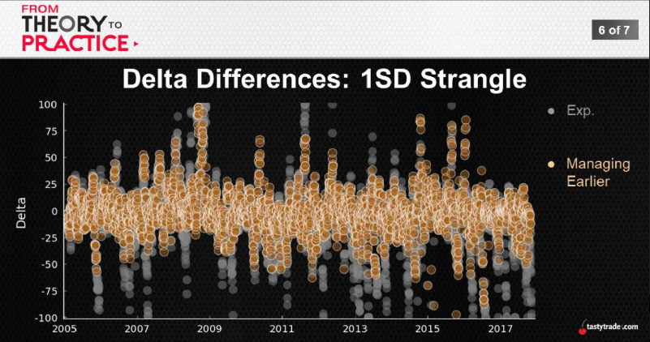

## Manageing Early
  * Part1: Average Performance
  * Part2: Long-Term Performance
  * Part3: Volatility and Risk
    
    

    ||Avg. Duration|
    :---:|:---:
    Breach call strike|30 days
    Breach put strike|24 days    
    Manage 3 week before exp.|22 days
    Manage 2 week before exp.|29 days
    Manage 1 week before exp.|36 days        

    ---
    % of positions that were breached
    ||No  Management|Close  1 week before|Close  2 weeks before|Close  3 weeks before|
    ---:|:---:|:---:|:---:|:---:
    Call side|25%|17%|10%|6%
    Put side|15%|11%|9%|5%

    ---
    P/L Comparisons
    ||Expiration|1 week earlier|2 weeks earlier|3 weeks earlier|
    ---:|:---:|:---:|:---:|:---:
    Avg. P/L|$57|$59|$45|$45
    Win Ratio|82%|84%|80%|81%
    Duration|43|36|29|23
    Daily P/L|$1.33|$1.64|$1.56|$1.96

    
    
    
  
    |SPY 1SD Strangle|Expiration|50% Winners|Earlier(Half-point)
    ---:|:---:|:---:|:---:
    \# of Occurrences|100|199|**197**
    Avg. P/L per Trade|$48|$43|**$42**
    Win Ratio|80%|90%|**84%**

    ### Trading (Only) Time...?
    * Trading the time dimension only is promising
    * Up? Down? Sideways?
    * We always talk about trading time
    * “The volatility of trading time...?"

    
    
    
    
