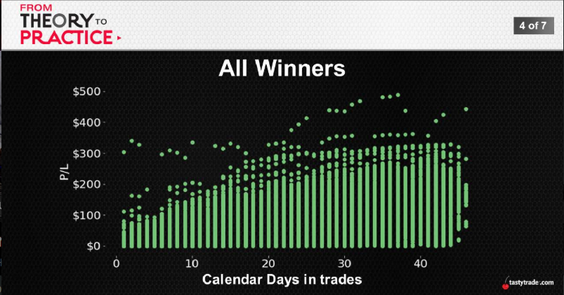
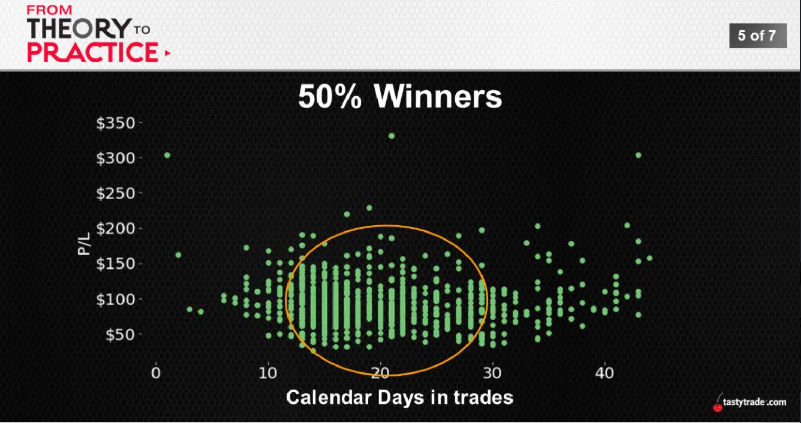
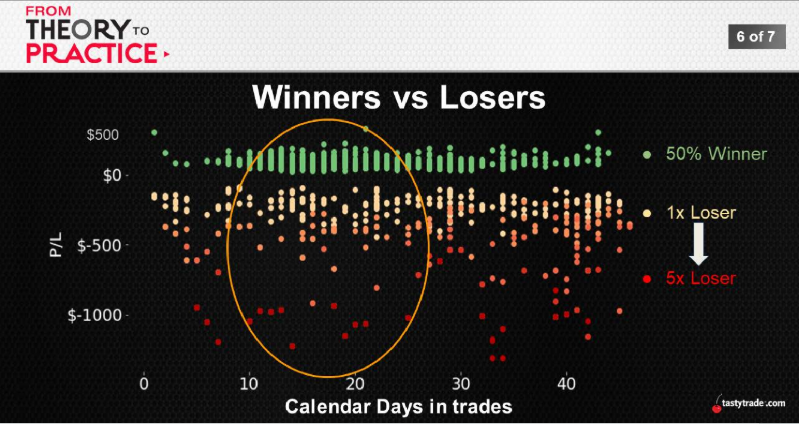
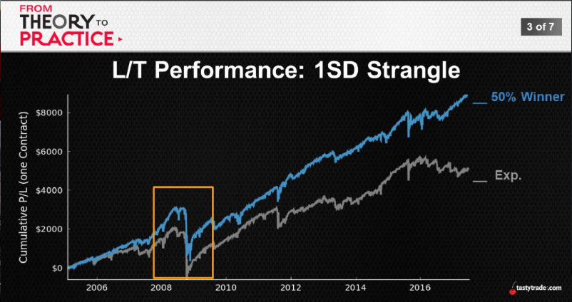
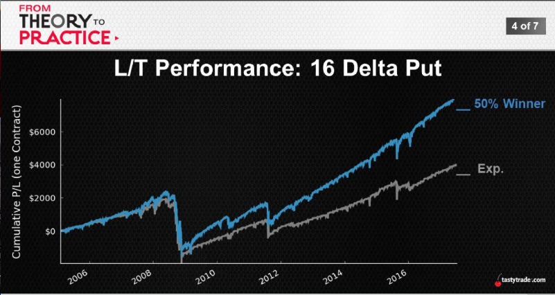
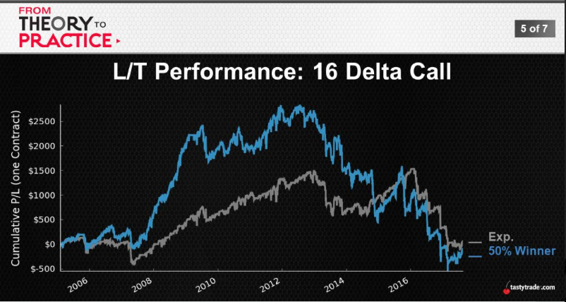

## Hold Options to Expiration?
## Managing Winners
  * Part 1: Average Performance
  * Part 2: Long-Term Performance
  * Part 3: Volatility and Risk
  * Topics (4) + Parets (3) = 12 segment

  ## Our "Core Position"
   * Duration over direction: time over movement
   * Trade small: give probabilities a chance
   * Nobody knows anything: embrace ignorance
   * Position management: winners at 50%

        |SPY 1SD Strangle|Expiration|50% Winners|
        ---:|:---:|:---:
        Avg.Premium|$109|$109
        Avg.P/L|$64|$38
        Avg.Duration|44|**23**
        Win Ratio|83%|**91%**
        Daily P/L|$1.49|**$1.65**
        Largest Loss|-$2,485|-$2,485
        ---
  
  
  

  
  
  

  
    |SPY 1SD Strangle|Expiration|50% Winners|
    ---:|:---:|:---:
    \# of Occurrences|100|199
    Avg. P/L per Trade|$48|$43
    Win Ratio|80%|90%

    