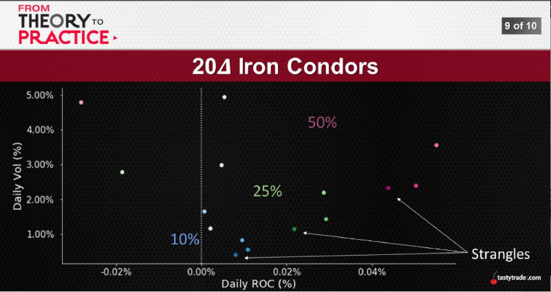
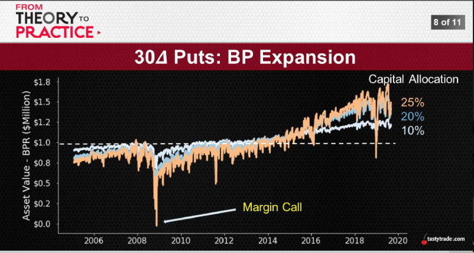
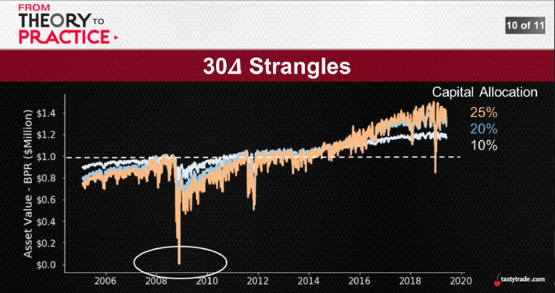
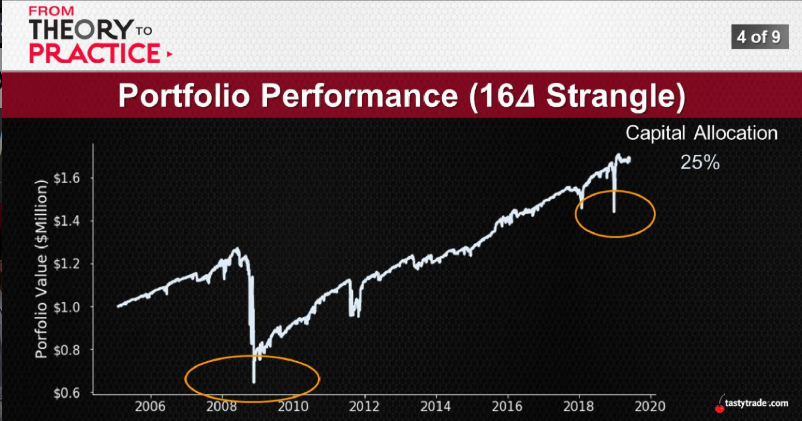
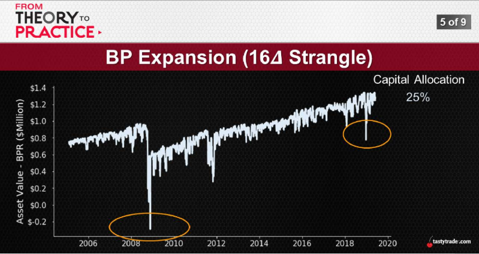
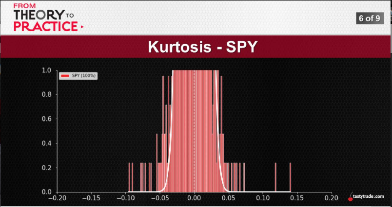
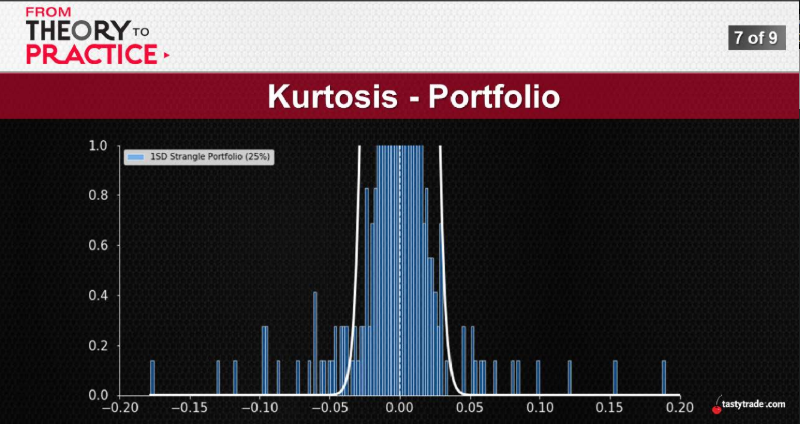
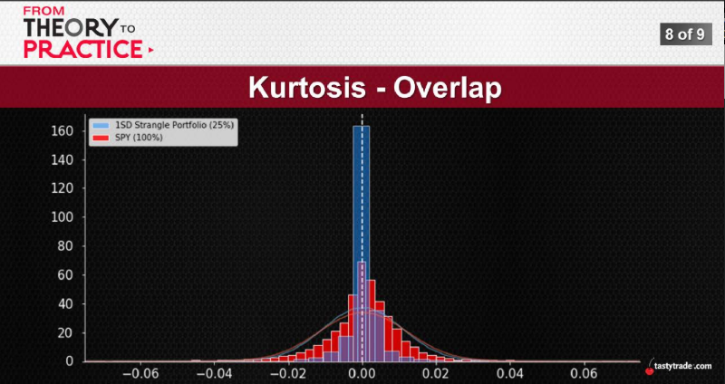

# [OCT 30, 2019](https://www.tastytrade.com/tt/shows/from-theory-to-practice/episodes/portfolio-tactics-building-blocks-portfolio-risk-part-one-10-30-2019)

## The Other Side
 Portfolio returns are the objective, but we can't ignore portfolio risk:
   * Risk? -> Standard Deviation, Implied Volatility, etc.
   * Generally speaking? -> movements and fluctuations
   * Less is more -> always prefer smoother ride

 But as tastytraders, we know...
 1. Volatility
  
  
  

  reduce volatility before you want to put more capital
## Buying Power as Risk
 Risk is typically thought of as volatility:
   * Always correct -> movements and fluctuations
   * Brokerage perspective? -> buying power is key
   * Combine the two -> the fluctuations of buying power
 
 As BP moves, fluctuates, and possibly expands, how does that change things?
 1. BP Expansion Risk
    The risk of increasing BP such that it exceeds the current asset value, which could trigger a Margin Call, (Net Liq < BPR) 
    
    
    when capital Allocation above 60% you lose all of your money in 2008 

    
    red is BP, gray is 50 delta put, when price drop, BP doubled
    
    
    green is OTM, BP lower, red is ITM lose position, BP higher

    
    y-aix is AssetValue - BP, you can't use over 25% capital in 30 delta puts alone.

    

    
## Man, Those Tails are Phat!
 As premium sellers, where are we most exposed...?
  * Expected Moves -> most likely outcomes
  * Extreme Moves -> outliers = headaches
  * Our two trusty companions -> kurtosis + skew

  Kurtosis does measure tail risk, but that's not all...

  Tail Risk: A form of portfolio risk that is releated to extreme, outlier moves that occur infrequently, as they relate to the Normal Distribution. Example: A stock moving 2 or 3 standard deviations from the mean

  
  IC vs Strangle, IC has more portfolio volatility, Strangle's downside is the tail risk

  
  More BP presure coming from call side, tail risk offen happen on the put side. strangle 68% presure coming from call side (bull marke t, losing money on the call side, annoning but manageable), when market crash, put side will feel hugh presure.

  
  
  
