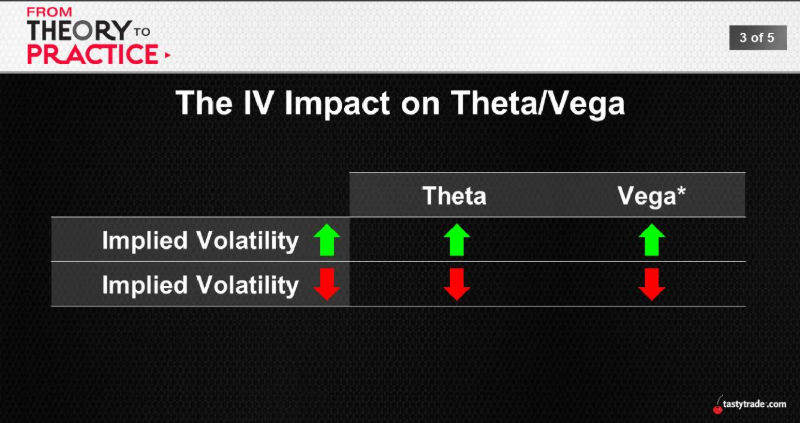
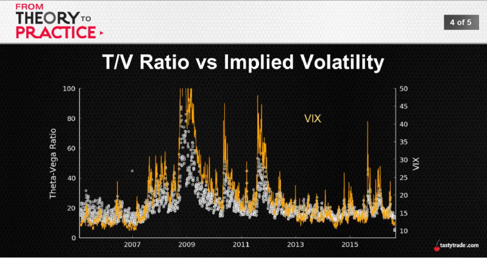

## Payment for Risk
### Positive Theta
* Option sellers (bear all the risk)
* Risk/Return -> that risk must be compensated

### Implied Volitity
* Higher IVs (bigger swings)
* Risk/Return -> consistently see IV > RV

Is there a way to "optimize" this relationship?

Average Performance -> T/V Ratio
|1SD Strangle|T/V < 20|20 < T/V < 30|T/V > 30|
:---:|:---:|:---:|:---:
Average P/L|$52|$63|$68
Max Loss|-$2389|-$2485|-$884

 
 

 Just look at VIX it tells you the ratio