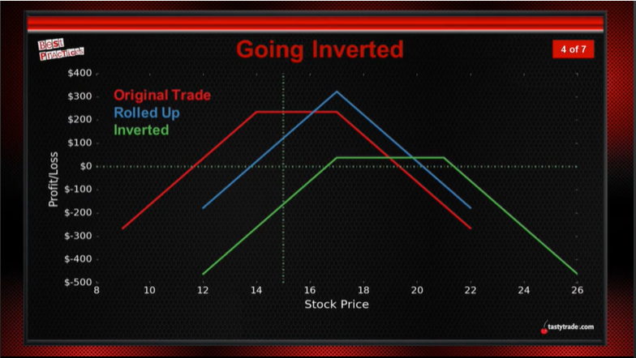
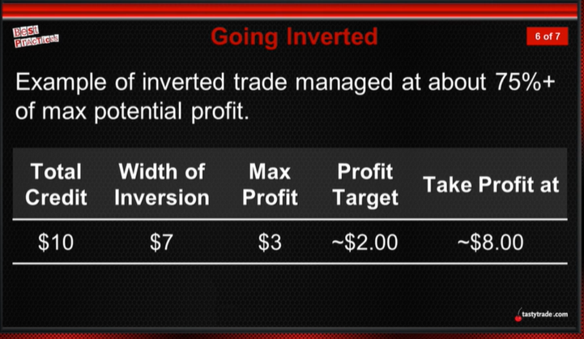

## How I decide to close a trade
   * Undefind risk: $2.00 credit, close at $6.00, 2 times credit close.
   * Defined risk: 
       * if it's a narrow spread, let it ride, close before expiration to avoid assignment fee.
                $1.00 credit, $3 wide, hopeful I can close it at $2.50, to avoid maxium lost $2.00
                if stock close to short position roll if u could get credit;
       * if it's a wider spread, $1.50 credit for $10.00 wide, will close it at $4.50 same as previous one
       * rolling is harder with defined risk
## How to avoid locking in losses when rolling
   * Be aware of breakeven when selling srikes
   * We can go below our stock ownership, but must collect enough to move breakeven in our favor
   * Locking in losses isn't the worst possible situation, but it's surely not the best!
## Defensive Tactics
   * Q: What are some signs that we need to play defense?
     * The trade has reached an uncomfortable level of expected succes (POP less that 33%)
     * Generally the trade has gone one to two times past an equivalent profit target.($1 credit vs $2-$3 lost)
     * Adding more is not an option
     * Have a willingness to add duration but not capital
   * Q: If tested, is there any way we can adjust the trade?
   * A: We may look to roll one leg of our position in order to collect additional premium and widen out breakeven points. We have found the most beneficial way to take advantage of this is to roll the untested side to your original probability as shown below:

        |SPY|Roll Tested Up|Roll Tested Out|Roll Tested Out and Up|*Roll UnTested Up*|No Management|
        :---:|:---:|:---:|:---:|:---:|:---:
        P/L|$228|-$139|$746|**$2,002**|$1,439
        \# of Winners|16/24|15/24|20/24|**20/24**|19/24
        % of Winners|67%|63%|83%|**83%**|79%
        P/L per Day|$0.37|-$0.08|$0.43|**$3.21**|$1.28
        Avg. Days Held|36|72|72|**36**|47 

   * Q: Do we roll defined risk trades?
   * A: Primarily we are comfortable with max loss on a defined risk trade and allow our probabilities to play out. For this reason, we normally do not roll defined risk trades. However, we will look to roll a spread if we are "on the dance floor" (short strike ITM/ATM and long strike OTM). when it on the dance floor, it's 50/50 shot for going higher or lower, so stay with it.
## 3 Considerations for Losing Trades
   * Directional Assumption
      * Has it changed?
      * Is it the same?
   * Rolling Credit Amount
      * Is it large enough to merit rolling?
   * Opportunities Elsewhere
   * Takeaways:
      * We don't have to chase our losers - can recover elsewhere
      * Rolling credit amount is important
      * Re-assess assumptions frequently
## Defending Trades Gone Bad-Rolling
   * Defending Strangle
      1. Roll up untested side (strangles)
      2. Roll out to next cycle
      3. Go inverted
   * Defending an Iron Condor
      * Tested on either side: Defined risk trade - let the probabilities play out.
   * Defending a Wide Iron Condor
      * Use same mechanics as a strangle
   * Defending a Straddle
      * Tested breakevens
      * Invert position by rolling the untested call down (or untested put up) if little time remains roll inverted position to next cycle.
   * Defending a Calendar
      * If at least one cycles between the front and back
        * Roll the short option to the following month to gain more credit and allow more time to be right.
      * If no cycle between front and back
        * Close out position look to redeploy
## Trade Defense
   * Data shows that positions showing losses at some point still had a good chance of being profitable.

   |Percent of trades that...|1 SD Strangle|
   ---:|:---:
   Expired with a positive P/L| 83%
   Could have been managed at 50% max profit|88%
   Showed a negative P/L at any point before exp.|79%
   Showed a 1x loss at any point before exp.|18%
   Showed a 1x loss at some point,  but came back to a profit before exp.|52%

   1x loss means: $2.00 credit, trade on $4.00 lose
## Going Inverted
   The three steps taken when mechanically adjusting undefined-risk spreads:
   1. Roll up or down the untested
   2. Roll out in time
   3. Go inverted
      * 
      * Going inverted is defensive and limits potential profit:
         * Potential Profit = Total credit - Width between strikes
      * We look to manage this inverted spread around 50% to 75% of potential profit
      * Example of inverted trade managed at about 75%+ of max potential profit.
        
      * Going inverted is no different than just rolling the untested side past the other short strike. It is a defensive move that limits profitability but allows your delta to stay more under control